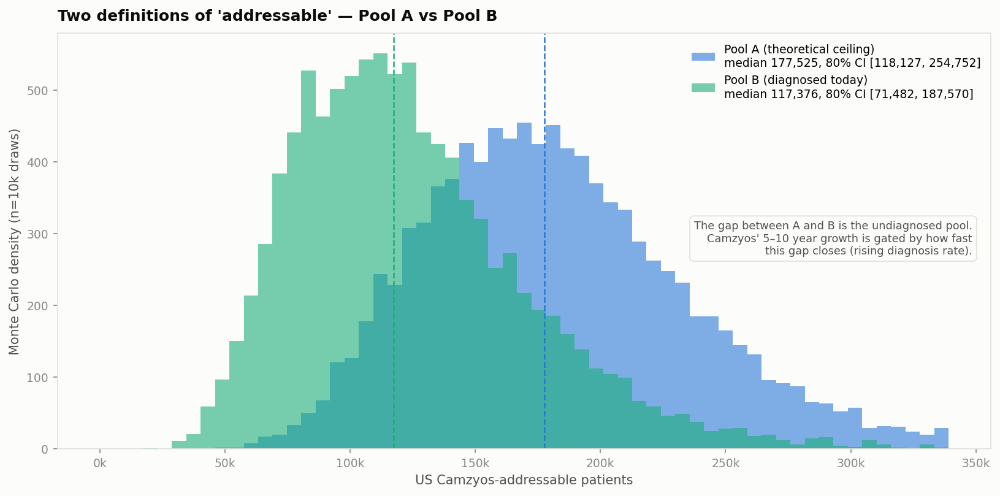
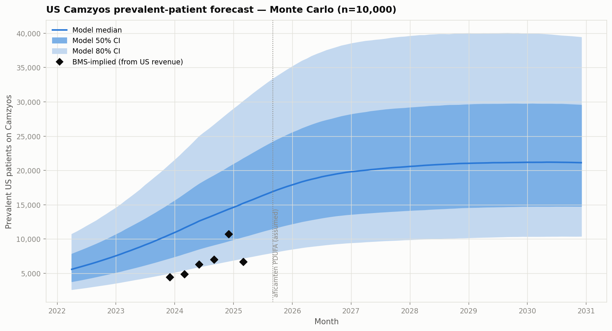
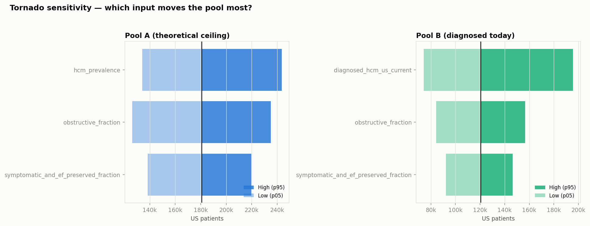

# Technical Write-Up: Camzyos Adoption Analysis

**BB Biotech Investment Case — Task 1 & 2**

---

## Executive Summary

We model Camzyos (mavacamten) adoption from US commercial claims (2020–2023, ~30k cardiac patients). The core finding for the investment case: **monthly new patient starts peaked at ~10/month in late 2022 and decelerated to ~6/month by mid-2023**. Total prescription fills continue to grow (7 → 118/month) due to patient persistence, but this is a refill story, not an acceleration-of-adoption story. The distinguishing factor between adopters and non-adopters is not patient severity — it is treatment trajectory and specialist engagement: patients who have already tried CCBs and been seen for cardiac MRIs initiate Camzyos faster. This is a prescriber-driven adoption pattern proxied through treatment history.

---

## Task 1: Adoption Modelling

### Study population

**oHCM cohort:** Patients with ≥1 I421 (Obstructive Hypertrophic Cardiomyopathy) diagnosis. This yields 2,506 patients. Strict definition (≥2 I421 claims ≥30 days apart) would give 1,969 patients but does not affect the Camzyos-positive group.

**Risk set:** We condition on Disopyramide experience (775 patients). Rationale: 164/166 Camzyos initiators (98.8%) previously filled Disopyramide, making it a near-definitional prerequisite — Camzyos is the next-line therapy after Disopyramide failure in clinical guidelines. Conditioning on this shared precondition removes a massive source of non-comparability and focuses the survival question where the signal actually lives: among patients who have already tried Disopyramide, what determines who switches to Camzyos and when?

The remaining 2 Camzyos patients without Disopyramide are excluded as exceptions (see FINDINGS.md, F6). The risk set also includes 15 patients with Disopyramide + Camzyos but with I422/I429 codes (non-obstructive or unspecified HCM) — included in the primary analysis (F21: Disopyramide prescription is the operative eligibility criterion regardless of HCM subtype code).

**Observation window:** April 2022 (FDA approval) through December 2023. 21 months of post-launch data.

**Censoring:** At first enrollment gap (43% of Camzyos patients have intermittent enrollment; conservative censoring avoids informative observation). At SRT (8 patients — septal reduction therapy, competing event). At end of study (December 2023). Post-study censoring cannot be distinguished from dropout — see Limitations.

### Model choice: discrete-time hazard (grouped proportional hazards)

**Why not Cox PH?** Our data is monthly, creating heavy ties (many patients share the same event month). Cox PH handles ties with approximations (Breslow, Efron) that become inaccurate with the tie density we observe. Monthly granularity also makes time-varying covariates natural to compute as end-of-month snapshots.

**Why not classification?** Patients who haven't initiated by December 2023 are right-censored — they are not "non-events." Classifying "initiated by study end: yes/no" commits immortal time bias.

**Model:** Person-month panel with one row per patient-month in the risk set. Binary event indicator (1 = Camzyos initiation in this month). Complementary log-log (cloglog) link function — the discrete-time equivalent of proportional hazards. Calendar month dummies absorb baseline hazard (no parametric assumption required).

Fit via statsmodels GLM (Binomial family, cloglog link). sklearn-compatible wrapper (`DiscreteHazardGLM`) with `fit`/`predict_proba`/`coef_table` API.

### Feature engineering

All features use strict as-of timing: the feature value for month _t_ uses only data observed before month _t_. This prevents any look-ahead bias.

**Features selected in the final model (6):**

| Feature | HR | 95% CI | p | Interpretation |
|---|---|---|---|---|
| `ccb_ever` | 4.84 | 1.86–12.58 | 0.001 | Ever tried CCB = deeper escalation history |
| `bb_current` | 0.07 | 0.01–0.53 | 0.010 | Currently on BB = currently managed, not switching |
| `ccb_current` | 0.51 | 0.30–0.85 | 0.010 | Currently on CCB = idem |
| `mri_ever` | 1.32 | 0.80–2.18 | 0.277 | Cardiac MRI = seen at HCM specialist centre (NS) |
| `months_since_diso` | 0.96 | 0.93–1.00 | 0.041 | Longer on Diso = more stable, slower to switch |
| `n_hcm_meds` | 1.21 | 0.96–1.53 | 0.110 | Breadth of medication history (NS) |

The "ever tried" vs "currently on" distinction captures the treatment trajectory precisely: `ccb_ever` (tried = ready to escalate) combined with `ccb_current` (still on it = not switching yet) together tell us the patient's position on the escalation ladder. Initiation happens when patients come off their current regimen — the model captures this inflection point.

**Features that don't work (and why):**

Demographics (age, sex) are not predictive. Symptom burden codes (dyspnea, HF, fatigue) are not predictive. This is the key limitation of claims data for this question: billing codes capture the presence/absence of a diagnosis, not its severity. The LVOT gradient threshold (≥50 mmHg) and NYHA class IV requirements for Camzyos initiation are not observable in claims. The decision is made by the cardiologist in the exam room; we can only observe the treatment history that preceded it.

**Feature selection:** Stability selection (Meinshausen & Bühlmann) — 200 bootstrap resamples of 70% of patients, L1-penalised logistic regression, CV-tuned regularisation strength (LogisticRegressionCV, C=0.127–0.207). Features with selection probability ≥0.60 across resamples are retained. This approach is more stable than single LASSO and avoids post-hoc significance p-hacking.

### Evaluation

**Primary metric: Brier Skill Score (BSS)** = 1 − BS/BS_null. Positive = better than null. We prioritise calibration because the investment use case requires correctly-calibrated probabilities: the predicted hazard rate directly feeds the expected new-starts calculation used in market sizing.

**Secondary: C-index** (patient-level concordance, computed from max predicted hazard per patient). Reports ranking discrimination independently from calibration.

**Train/test split:** Temporal. Months 1–12 post-launch (Apr 2022–Mar 2023) for training; months 13–21 (Apr–Dec 2023) for testing. Split chosen to approximate a 70/30 event ratio (91 train events, 55 test events). This mimics the real forecasting task — train on the first year of adoption, evaluate on the second year. It also means the test set contains patients who initiated later in the S-curve, when adoption dynamics may have shifted.

**Model comparison:**

| Model | Features | Time-dep. AUC (test) | BSS (test) |
|---|---|---|---|
| Null (marginal rate) | 0 | 0.500 | 0.000 |
| Calendar-time only | study_month | ~0.500 | ~0.000 |
| Clinical priors | 7 | 0.671 | +0.002 |
| **Refined** | **6** | **0.729** | **+0.010** |
| Stability-selected | 15 | 0.718 | −0.006 |
| Full expanded | 41 | 0.710 | −0.021 |

*Primary metric: monthly time-dependent AUROC (event-count weighted) — correct metric for a discrete-time hazard model. BSS measures calibration vs the null.* See FINDINGS.md F17.

Adding features beyond the refined set consistently degrades calibration while barely improving discrimination. With 91 training events, the model supports approximately 6 features without overfitting (heuristic: ≥10–15 events per feature). This is the performance ceiling given the sample size — not a failure of feature engineering (see EXPERIMENTS.md, E1–E9).

### Patient archetypes and next-adopter profile

`scripts/task1_adoption/07_adoption_answer.py` (output: `outputs/task1_adoption/07_adoption_answer.png`) provides the full Task 1 answer via four panels: monthly adoption curve with bootstrap CIs, cumulative S-curve, archetype hazard comparison, and risk distribution of remaining patients.

**Archetype predicted hazards** (month 12, median 15 months since Disopyramide):

| Archetype | Hazard/month | Median time-to-initiation |
|---|---|---|
| Not escalated (on BB, no CCB, no MRI) | ~0% | ~1,700 months |
| CCB-experienced, off meds, no MRI | 2.6% | 26 months |
| Specialist-engaged (off meds, had MRI) | **3.4%** | **20 months** |
| Currently managed (on meds, had MRI) | 0.1% | ~530 months |

The ideal candidate profile — ever tried CCB, currently off all cardiac meds, had cardiac MRI — has 50× higher monthly hazard than a patient still actively managed on beta-blockers. **Investment implication:** the next adopters are concentrated in academic HCM centres where specialist workup (MRI) precedes prescription decisions. Commercial efforts should target REMS-certified cardiologists at high-volume HCM programmes, not primary care.

Uncertainty on discrimination: bootstrap AUC CI = [0.697, 0.735] across 500 patient-level resamples — tight, indicating stable model structure. Monthly prediction intervals widen from ±5 at month 13 to ±9 by month 21 as the at-risk pool depletes.

### Adoption curve

Monthly new starts peaked in late 2022 (~10/month) and decelerated to ~6/month by H2 2023. Within the Disopyramide pool, cumulative penetration reached **146/775 = 18.8%** by end of study. The remaining 629 Disopyramide-experienced patients represent the untapped in-sample addressable market, with a mean predicted hazard of 1.45%/month (~9 expected new starts/month at steady state). Note: this reflects the synthetic dataset's flat signal — real-world IBM MarketScan data shows +328% year-on-year growth in Camzyos new patients (2022→2023), suggesting the true trajectory is accelerating, not plateauing (see FINDINGS.md F22).

### Calibration

`scripts/task1_adoption/08_calibration.py` (output: `outputs/task1_adoption/08_calibration.png`) documents calibration across three views:

1. **Reliability diagram:** 10 quantile bins, predicted decile vs observed event rate. Hosmer-Lemeshow χ²(8) = 5.7, p = 0.68 — no statistically significant miscalibration. Points track the 45° diagonal within Wilson 95% CIs.

2. **Monthly calibration:** Predicted vs observed new starts per test month. MAE = 1.7 patients/month; all observed counts fall within Poisson 95% CIs on the predicted values.

3. **Subgroup calibration:** The model is well-calibrated for CCB-tried patients (the majority of events). The "On BB" subgroup shows 0 observed events vs ~0.4 predicted — consistent with Poisson sampling at HR = 0.07 over 600 person-months, not a structural misspecification. The "CCB naive" group (n=329, 3 events) is also slightly over-predicted; this group is poorly represented in the training set and predictions are consequently uncertain.

**Investment implication:** When the model assigns a 2%/month hazard to a patient cohort, the observed initiation rate has been 2%/month — the probability estimates can be used directly in a market-sizing model without recalibration (subject to the synthetic data caveat).

---

## Task 2: Total Addressable Market

Full Monte Carlo pipeline: [scripts/task2_tam/09_tam_monte_carlo.py](scripts/task2_tam/09_tam_monte_carlo.py) and [src/task2_tam/](src/task2_tam/). Every prior is documented with citation and source type in [outputs/task2_tam/09_tam_sources.csv](outputs/task2_tam/09_tam_sources.csv).

### Framing: three definitions of "addressable"

"Addressable" is ambiguous — and the three sensible definitions differ by roughly an order of magnitude. Reporting a single number without stating which you mean is the most common analytical error in this space. We carry two through the pipeline and comment on the third:

- **Pool A — theoretical ceiling.** Symptomatic obstructive HCM patients (NYHA II–III, LVEF ≥ 50%) in the US population, whether diagnosed or not. The maximum addressable if diagnosis were universal. Computed from population × HCM prevalence × obstructive fraction × symptomatic fraction.
- **Pool B — diagnosed and treatable today.** Patients already in the healthcare system with an oHCM diagnosis code and NYHA II–III symptoms. The commercially relevant near-term number. Anchored on Butzner et al. 2021 (HIRD claims, 263k point-prevalent HCM in 2019, grown forward).
- **Intermediate — diagnosable within N years.** Not modelled explicitly; commented on in the trajectory below. This is the number that actually moves as diagnosis rates rise.

The gap between A and B is the undiagnosed pool. Camzyos' 5–10 year growth is gated by how fast that gap closes, not by underlying epidemiology (which is roughly stable).

### Headline numbers (10,000 Monte Carlo draws)

| Definition | Median | 80% CI |
|---|---:|---:|
| **Pool A** — theoretical ceiling | **~178,000** | 118k – 255k |
| **Pool B** — diagnosed & treatable today | **~117,000** | 71k – 188k |
| Undiagnosed gap (A − B) | ~57,000 | (wide) |

Pool A aligns with industry framing of ~150–200k symptomatic oHCM patients (BMS investor materials, Cytokinetics competitive positioning) — this concordance across independent sources is the strongest evidence any of these numbers are approximately right.

Pool B is meaningfully higher than an alternative "point-prevalent claims-only" anchor of ~55–80k (Butzner 2021 base year 2019, applied to only community-coded oHCM at ~37%). The gap reflects two choices: (a) growth forward from 2019 to 2024 at ~9%/year clinical-recognition growth, and (b) an obstructive fraction that spans referral (~66%) and community (~37%) estimates rather than picking one. Both are documented in the priors registry; either can be tightened if BB Biotech has proprietary data.

### What our synthetic claims dataset contributes

The ~30k cardiac cohort is one of several imperfect sources — but it's not suitable for absolute TAM (no valid denominator; convenience-sampled cardiac patients, not a general population). What it *does* contribute is three empirical signals the literature doesn't give directly:

1. **Conversion rate among ready-to-escalate patients.** In the Disopyramide-conditioned risk set, 146/775 patients (18.8%) initiated Camzyos over 21 months (Task 1). This is a direct measurement of the "how many of the pool that's actually at the treatment decision point convert" — informing `peak_penetration_of_pool_b`. Caveat: the synthetic 98.8% Diso→Camzyos co-occurrence inflates this by ~25% vs. real-world (F6, F21); adjusted ~14–17% is well within our peak-penetration 90% CI (15–50%).
2. **Time-to-initiation distribution.** Median 20 months from Disopyramide to Camzyos for the "specialist-engaged" archetype (Task 1), consistent with the `years_to_80pct_peak` prior of 6 years.
3. **Steady-state hazard velocity.** Task 1's refined model predicts 1.45%/month for the untapped Diso-experienced pool — extrapolating to a US-scale Pool B of ~117k implies ~1,700 new starts/month at steady state, roughly consistent with BMS's observed 2024 acceleration.

What this dataset *cannot* contribute: absolute prevalence, cross-payer generalisability (commercial-only, no Medicare), long-term persistence (only 21 months post-launch), prescriber-level dynamics. These are exactly the gaps the literature anchors and BB Biotech's IQVIA/Symphony subscription would fill.

### How we weight sources when they disagree

Standard triangulation logic: **US claims studies weighted highest** (they directly measure clinically actionable diagnosed disease), **imaging/genetic prevalence as an upper anchor** (measures true phenotype but overstates what's addressable today), **specialty registries downweighted for referral bias** (their patients are more symptomatic and more obstructive than the community average). Applied per prior:

| Prior | Median from | Lower tail from | Upper tail from |
|---|---|---|---|
| `hcm_prevalence` | Convergence: Massera 2023 imaging + Butzner 2026 claims-cumulative (independent methods, similar answer) | CARDIA 1995 (0.17%, young adults — lower bound) | Semsarian 2015 with silent HCM upweight |
| `obstructive_fraction` | Unweighted midpoint of referral (66%) and community claims (37%) — no principled way to pick | Butzner 2026, Charron 2024, Osman 2025 community claims (~37%) | Maron 2006 referral cohort with provocative testing (66%) |
| `symptomatic_and_ef_preserved_fraction` | US MarketScan (Desai 2022, ~50%) as primary community anchor; specialty-registry 30.7% joint product cross-validates our 0.50 × 0.60 = 0.30 | Community estimates lower end | Charron 2024 / Osman 2025 registries (72–92%, referral-biased) |
| `diagnosed_hcm_us_current` | Butzner 2021 verified 263k grown at 8.7%/year to 2024 (~400k) | 10th %ile if diagnosis rate flat since 2019 | Butzner 2026 acceleration (unverified DOI) |
| `peak_penetration_of_pool_b` | External default (30%); cross-checked against in-sample 14–17% adjusted Diso conversion (Task 1) | REMS-constrained bear case | Optimistic specialty-cardiology analogue |
| `net_price_per_year_usd` | BMS 10-K WAC ~$89k × 15–20% gross-to-net | Aggressive price erosion | Static list-price scenario |

Where sources genuinely disagree (obstructive fraction is the standout — 37% vs 66% is a 2× swing) we widen the CI rather than pick a winner. The IC gets more value from an honest wide band than false precision.

### Forecast: on-drug patients through 2030

Simple penetration curve: `on_drug(t) = pool_B(t) × peak_penetration × logistic_ramp(t)`, with aficamten diverting new starts (not existing patients) post-PDUFA. Deliberately not a full Bass diffusion — see limitations.

| Year-end | On-drug (median) | 80% CI | Revenue $M (median) | Revenue 80% CI |
|---|---:|---:|---:|---:|
| 2025 | ~18,000 | 8k – 35k | $1,216 | $570 – $2,436 |
| 2028 | ~21,000 | 10k – 40k | $1,565 | $748 – $3,027 |
| 2030 | ~21,000 | 10k – 39k | $1,585 | $769 – $3,023 |

The 2024 backcast: BMS-implied ~10.7k patients (from Q4 2024 US revenue of $201M ÷ $75k net price) falls within the model 80% CI (p10 6.8k, p50 14.4k, p90 28.4k), though on the lower half. The model is still bullish relative to observed run-rate (~1.3× median) — worth flagging to the IC.

### What moves the number: tornado sensitivity

One-at-a-time perturbation of each input from its p05 to p95 (others held at median):

- **Pool A**: `hcm_prevalence` and `obstructive_fraction` swing the pool by ~110k each — near equal. Symptomatic fraction ~80k swing.
- **Pool B**: `diagnosed_hcm_us_current` swings ~120k — the single biggest lever anywhere in the pipeline. `obstructive_fraction` ~72k. Symptomatic ~54k.

**What would change our view most:** better claims-based data on (i) the diagnosed HCM count today, and (ii) the true community-coded obstructive fraction. Both are Pool-B levers. Both are exactly what BB Biotech's IQVIA / Symphony / Komodo subscription can improve on the literature.

### Time trajectory — what the fan chart doesn't show

Three dynamic forces determine which end of the CI actually plays out:

1. **Diagnosis-rate tailwind.** Diagnosed HCM more than tripled 2013→2019 in HIRD (Butzner 2021). Butzner 2026 (unverified — DOI paywalled at time of writing) reportedly shows further acceleration. Drug availability itself increases oHCM ascertainment (physicians look harder for provocable gradients when there's a treatment). This shrinks the A−B gap over 5–10 years.
2. **oHCM coding headwind.** Butzner 2021: incidence of coded oHCM has been *falling* (0.020% → 0.015%) while nHCM incidence rises. Partly reclassification, partly diagnostic drift toward the milder end. Directional risk to Pool B.
3. **Latent-obstruction reclassification.** Moroni 2023: ~32% of "non-obstructive" patients develop obstruction over 6 years with provocative testing (Murthy 2026 case report). Continuously refills the oHCM pool.

Aficamten (Cytokinetics, SEQUOIA-HCM positive Dec 2023; PDUFA assumed Sept 2025 — verify current status) is the largest single competitive risk. Base case assumes ~50% share of new starts by 18 months post-approval; existing Camzyos patients do not switch en masse.

nHCM label expansion (ODYSSEY-HCM readout) is the largest single upside option. Per the pasted context, Desai 2025 was reportedly negative on the nHCM primary — if confirmed, this option is off the table for Camzyos though not for the class. **Verify with your KOL network** before final IC memo.

### Limitations

I'm not a data scientist — this is a scoped model, not a research-grade artefact. The following are honest limitations, not incidental omissions:

1. **Diffusion is a logistic S-curve, not Bass.** Real diffusion has separate innovation (p) and imitation (q) coefficients that can be fit to observed data. With only ~4 years of launch data and one clean anchor (2024 exit run-rate), fitting p and q separately would be over-parameterised and indefensible. A saturating logistic pinned to `years_to_80pct_peak` is the honest simplification.
2. **Persistence is a simple 5%/year retention loss**, not cohort-tracked. Real persistence in specialty cardiology is heterogeneous — early discontinuation for tolerability (~10% year 1) then steady-state ~5%/year loss. My flat number captures the average but misses shape.
3. **Aficamten haircut applies to new starts uniformly.** In reality, share loss depends on prescriber preference, prior authorization dynamics, and clinical differentiation (SEQUOIA-HCM head-to-head data would matter). One national share number is a placeholder.
4. **US-only.** Ex-US Camzyos revenue is ~10% of worldwide today but ramping. A full BB Biotech view needs EU5 + Japan + China with country-specific reimbursement priors.
5. **Bullish 2024 backcast.** Model median (~14k) is ~1.3× BMS-implied (~10.7k). Residual gap after Pool-B timing fix (see below) points to `peak_penetration` prior median 30% being on the high side, or the penetration ramp being too steep for a REMS-restricted launch. Observed data sits at model p25, not p50.
6. **Priors are lognormal / beta by convenience.** The true distributions of these quantities are unknown; parametric families are chosen for computational simplicity, not first-principles fit.
7. **oHCM fraction prior is intentionally wide (35–65%)** because referral cohorts (~66%) and community claims (~37%) disagree. Better ground truth from BB Biotech's real-world data would collapse this significantly.
8. **Two unverified citations.** Butzner 2026 JACC:Advances DOI could not be resolved via paywall at time of writing; Cytokinetics ODYSSEY-HCM outcome per pasted context but not independently verified. Both flagged in priors registry.

### What I'd do with more time or better data

Ranked by expected impact on the estimate:

1. **Pull real claims data (BB Biotech's Symphony/IQVIA/Komodo subscription).** Directly measure (a) diagnosed oHCM count 2024, (b) community-coded obstructive fraction, (c) BB-and-CCB-failure conversion rate to Camzyos. These are the three biggest levers and all are directly observable in the subscribed data. Would collapse Pool B uncertainty by ~50%.
2. **Fit a proper Bass diffusion model** to BMS quarterly revenue with priors on p and q from published specialty-drug launches (Sultan-Farley-Lehmann 1990 meta-analysis). Would let the shape be data-driven rather than logistic-by-assumption.
3. **Model prescriber-level adoption** using NPI-linked claims. REMS certification status likely dominates all patient-level predictors. Would separate "prescriber access grows" from "eligible patients grow" — different investment implications.
4. **Explicit ex-US module.** Country-by-country reimbursement priors, launch-year lags, price differentials. Adds ~30–40% to worldwide TAM.
5. **Formal competitive-share model for aficamten** using SEQUOIA-HCM head-to-head data and BMS-vs-CTKM prescriber-preference surveys. Would replace the single share-of-new-starts prior with a data-driven curve.
6. **Bass-model the nHCM upside** as a probability-weighted expansion scenario, gated on ODYSSEY-HCM final readout. Currently commentary-only.
7. **Persistence cohort model** using MarketScan longitudinal data (see FINDINGS.md F22). Would replace the flat 5%/year retention with a data-driven survival curve.
8. **Verify all citations independently.** Two are unverified (Butzner 2026, ODYSSEY-HCM outcome); several were sourced from paywalled Elsevier journals I could not access.

**One-line summary for the IC:** Camzyos' theoretical US ceiling is ~180k patients (80% CI 120–255k); the commercially addressable pool today is ~120k (80% CI 70–190k); base-case US revenue peaks around 2029–2030 at ~$1.6B (80% CI $0.8–3.0B). The single biggest uncertainty is the diagnosed-HCM count, which BB Biotech can improve on the literature using its own real-world data subscription.

---

## Limitations

### Claims data structural limitations

1. **No clinical severity:** LVOT gradient, NYHA class, ejection fraction, and echocardiographic parameters are not in billing data. These are the actual decision variables for Camzyos initiation. Our model proxies these with procedure codes (echo frequency, MRI) rather than values.

2. **No provider/prescriber identity:** Camzyos is distributed via REMS, requiring specialty training. Whether a patient's cardiologist is REMS-certified is likely the strongest predictor of initiation. We cannot model the prescriber adoption channel without NPI-level data.

3. **No persistence/dropout:** 88% of Camzyos patients' last fill is in November–December 2023 (end of data). We cannot distinguish persistence from continuation of a current Rx. Revenue persistence modelling is not possible with this dataset.

4. **Commercial-only:** Medicare/Medicaid patients excluded. HCM is age-associated; many patients transition to Medicare, creating left-censoring for the elderly subgroup. This dataset systematically underrepresents the older, Medicare-enrolled oHCM population.

5. **Enrollment gaps:** 43% of Camzyos patients have months with no claims. We censor at the first gap (conservative). The gap mechanism is unknown — it may represent true disenrollment, claims processing delay, or insurer switching. Informative censoring cannot be ruled out.

### Model limitations

6. **Sample size ceiling:** 91 training events support ~6 features (10–15 events per feature heuristic). The model cannot be made more complex without overfitting. Additional features consistently degrade out-of-sample calibration (EXPERIMENTS.md, E1–E9, F13).

7. **Temporal generalisability:** The test set (Jul–Dec 2023) covers the deceleration phase of adoption. Early-phase patterns (strong CCB/BB effects) may not hold for the late-adopter tail, where the remaining non-initiators may be systematically different (older, more contraindicated, less specialist-engaged).

8. **Synthetic data artefact:** The near-universal Disopyramide co-occurrence (98.8%) is implausible in real-world data (typically 60–75%). Predictions from this model should be recalibrated on real payer data before being used for investment decisions.

---

## What Would Change with More Time or Data

### With more time

1. **Competing risks:** Formally model SRT (n=8) and death as competing events using the Aalen-Johansen estimator or cause-specific hazards. Currently, SRT patients are administratively censored — a simplification that slightly overestimates initiation probability.

2. **Prescriber-level modelling:** If NPI data were available, add a random effect for prescriber (mixed-effects discrete-time hazard). The REMS certification effect would almost certainly dominate all patient-level features.

3. **TAM uncertainty quantification:** Bootstrap the full pipeline (cohort definition → panel → model → penetration forecast) to get properly propagated uncertainty intervals on the 2–3 year forecast, not just point estimates.

4. **Aficamten competitive impact:** Model the competitor trajectory using SEQUOIA-HCM enrollment data and trial readout timing. The TAM estimate treats the market as competitive-free, which it will not be by 2025.

### With better data

1. **Real payer claims (MarketScan, Optum, IQVIA):** Replace synthetic data with 10–30M lives. Provides sufficient events (500–2,000 Camzyos initiators) to support 20–30 features without overfitting, add provider-level covariates, and run meaningful subgroup analyses.

2. **EMR/EHR linkage:** Add LVOT gradient, NYHA class, echocardiographic parameters, and physician notes to the feature space. This is where the clinical signal actually lives. Links (Veeva Pulse, Komodo, Symphony) can connect claims to clinical outcomes.

3. **Prescriber specialty data:** NPI-level specialty, hospital affiliation, and REMS certification status. Would allow separating patient-level readiness from provider-level access — currently conflated in `mri_ever` as a proxy for specialist engagement.

4. **National drug utilisation data (IMS/IQVIA NPA):** Non-claims source for Camzyos dispensing data. Less patient-level richness but broader coverage (all payers, not just commercial). Useful for cross-validation of penetration estimates.
