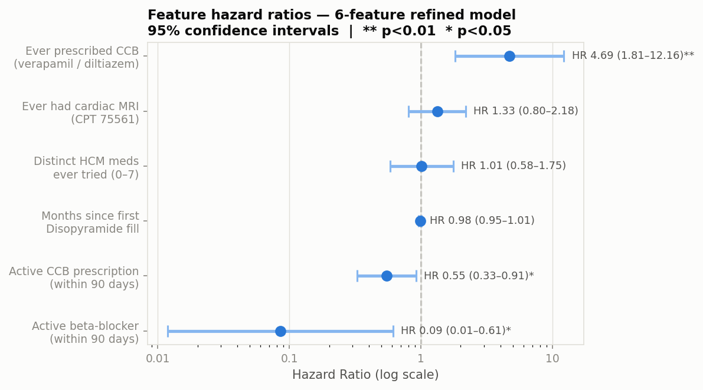
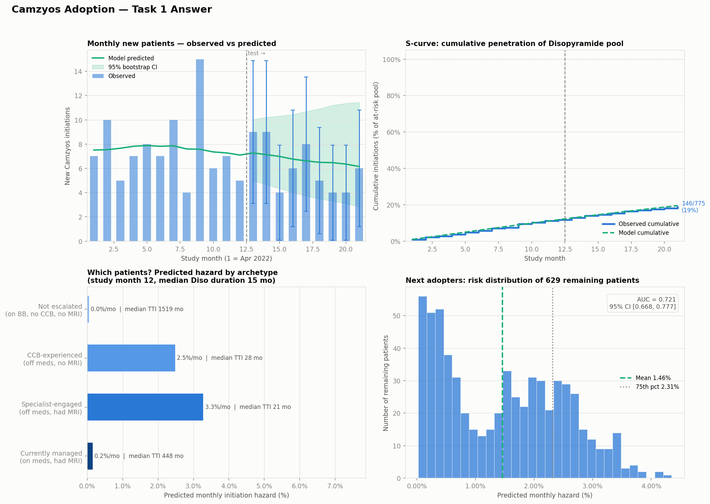
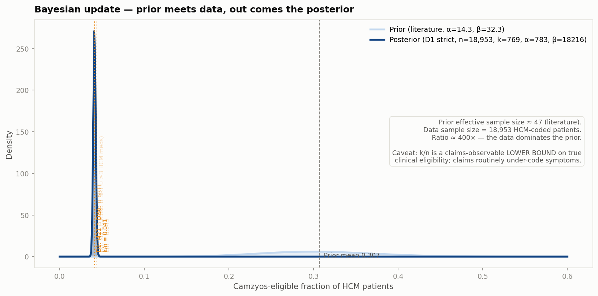

# Camzyos (mavacamten) — Adoption Dynamics and US Addressable Market

**Case study | BB Biotech | July 2026**

---

> **Abbreviations used in this document**
>
> **AUC** — area under the ROC curve (discrimination metric) | **BB** — beta-blocker | **BSS** — Brier Skill Score (calibration metric) | **CCB** — calcium channel blocker (verapamil, diltiazem) | **CI** — confidence interval | **EHR** — electronic health record | **GLM** — generalised linear model | **HCM** — hypertrophic cardiomyopathy | **HR** — hazard ratio | **LVEF** — left ventricular ejection fraction | **MRI** — magnetic resonance imaging | **NYHA** — New York Heart Association functional class | **oHCM** — obstructive HCM | **PDUFA** — Prescription Drug User Fee Act (FDA review deadline) | **REMS** — Risk Evaluation and Mitigation Strategy (FDA-mandated distribution programme) | **SRT** — septal reduction therapy (surgical or catheter-based) | **TAM** — total addressable market | **WAC** — wholesale acquisition cost

---

## Bottom line

**Task 1.** Treatment escalation history — not demographics or diagnosis codes — is the strongest predictor of Camzyos initiation in claims data (AUC 0.72, 6-feature model). The dominant signal is whether a patient has *already tried and moved past* first-line therapy (ccb_ever HR 4.69, p < 0.01), not age, sex, or symptom-burden billing codes. This is *consistent with* a prescriber-driven adoption pattern (specialists who have escalated treatment are the ones prescribing Camzyos), but it cannot be ruled out that clinical severity (LVOT gradient, NYHA class), invisible in billing data, is the true underlying driver.

**Task 2.** The US addressable pool depends on which of two questions you're asking. Running a *prior-predictive* Monte Carlo over published sources gives **~121k diagnosed treatable patients today** (80% CI 75–195k), inside a theoretical ceiling of **~181k** (123–259k) that will take 5–10 years to reach as diagnostic ascertainment improves [@butzner2021]. Running a *posterior-predictive* update — using our 30k-patient claims cohort to Bayesian-update the eligible-fraction prior (Beta-Binomial conjugate; see below) — collapses Pool B to **~17k** (11–24k) because claims-based proxies for symptomatic obstructive disease under-code by roughly 8×. The truth lies between, and the gap is exactly what BB Biotech's claims subscription is priced to close.

---

## Task 1 — Who is initiating Camzyos, and when?

### The data

Synthetic US commercial claims on ~30k cardiac patients (2020–2023). The dataset contains 166 unique Camzyos (mavacamten) patients. All 166 carry an HCM diagnosis code (ICD-10 I421/I422/I429), and 90.4% (150/166) specifically carry the oHCM code (I421) — consistent with claims-based oHCM identification using a simple code-existence approach, as described in the Camzyos FDA label [@fda_camzyos_label], which defines the indication as symptomatic NYHA class II-III oHCM.

98.8% of initiators in this dataset have prior Disopyramide. The remaining ~1% without a recorded Disopyramide fill could reflect coding inconsistencies, missing claim records, or left censoring — these patients may have received Disopyramide before entering the observation window or under a different insurer, so the fill is simply not captured. Based on this, the analysis is limited to patients with Disopyramide experience (775 patients, 146 Camzyos initiators over 21 months post-launch). This is clinically motivated: Camzyos is the next-line therapy after Disopyramide failure in clinical guidelines, and Disopyramide conditioning selects the population where the prescribing decision is most relevant.

**Censoring.** Of the 775 patients: 146 initiated Camzyos (the event); 433 were administratively censored at the end of the study period (December 2023); 196 (25.3%) exited early due to enrolment gaps (loss of insurance coverage) or competing risk events. SRT (alcohol septal ablation, CPT 93583) is treated as a competing risk — 144 patients in the full dataset underwent SRT, with zero overlap with Camzyos initiators, validating the competing-risk framing. All Camzyos initiators were still on therapy at data cut, meaning the outcome is *time to initiation*, not duration of therapy.

### Train/test split: why temporal?

The dataset is split **strictly by calendar time**: months 1–12 (April 2022 – March 2023, 91 events) for training, months 13–21 (April – December 2023, 55 events) for testing. A temporal split — rather than random cross-validation — is used because it mirrors the actual deployment context: a model trained on historical data and applied to unseen future patients. In person-month panel data, random CV would additionally leak information across time points of the same patient.

### Model: discrete-time hazard GLM

**Why this model?** Patients enter and exit the risk set at different times (staggered entry, administrative censoring). A standard logistic regression would discard this timing structure. A discrete-time hazard model treats each person-month as a separate observation: "given that this patient has not yet initiated Camzyos, what is the probability they initiate *this* month?"

The complementary log-log (cloglog) link function is used because it maps directly to continuous-time proportional hazards — the coefficients are interpretable as log hazard ratios (HR), the standard effect-size measure in survival analysis.

**Baseline hazard.** Time is captured by a continuous linear trend on study month (month 1 = April 2022), not calendar-month indicator variables. Dummies would collapse to zero for unseen future months in the test set, making the model unable to extrapolate. The continuous trend allows the baseline hazard to evolve smoothly into the test window.

### Evaluation metrics

Three complementary metrics: **time-dependent AUC** (can the model rank future initiators above non-initiators within each month?), **Brier Skill Score** (are predicted probabilities better calibrated than the base rate?), and **count calibration MAE** (do predicted aggregate monthly counts match observed counts?).

### Feature engineering

Claims data is transformed into a **person-month panel**: each row represents one patient in one calendar month, and the outcome variable is a binary indicator for whether that patient initiated Camzyos in that month.

Every feature is computed using strict **as-of logic** — only information from *before* the current panel month is used. This prevents look-ahead bias. Concretely, for a row representing patient P in month M:

- **"Ever" flags** (e.g., `ccb_ever`): scans all prescription fills for patient P with a fill date in any month *strictly before* M. If at least one CCB fill exists, the flag is 1. This means the flag can flip from 0 → 1 as one moves forward in time, but never back.
- **"Current" flags** (e.g., `bb_current`): checks whether patient P has a beta-blocker fill whose coverage window (fill date + 90 days) extends into month M. A fill in month M itself is excluded. This captures whether the patient is actively managed on that drug class right now.
- **Duration measures** (e.g., `months_since_diso`): the number of calendar months between the patient's first Disopyramide fill and month M. Increases by 1 each month.
- **Counts** (e.g., `n_hcm_meds`): the number of distinct HCM guideline medications (out of 7 possible: 4 beta-blockers, 2 CCBs, Disopyramide) with at least one fill strictly before month M.

**Handling enrolment gaps.** If a patient has a gap in insurance coverage (a month where they are not enrolled), they are censored at the first gap, i.e., all subsequent person-months are dropped.

41 candidate features were constructed in total, spanning demographics (age, sex), comorbidity diagnosis codes, medication classes, and procedure history.

### Feature selection: stability selection

From the 41 candidates, stability selection [@meinshausen2010] is applied to identify features with robust predictive signal. This method is preferred over standard stepwise or LASSO selection because it controls the family-wise error rate while being robust to the choice of regularisation strength — important when the sample size is small and the risk of overfitting to noise is high. The procedure:

- **200 bootstrap resamples**, each drawing 70% of *patients* (not rows — patient-level resampling prevents leakage across person-months of the same individual)
- **L1-penalised logistic regression** fit on each subsample. The regularisation strength *C* is tuned via 5-fold cross-validation on the training set
- Features are kept if their coefficient is non-zero in **≥60% of resamples** (the Meinshausen-Bühlmann threshold for controlling family-wise error)

### Results

#### Feature selection outcome

Six features survive the ≥60% stability threshold. Lower thresholds (e.g., 50%) admit additional features, but these degrade calibration on the test set — consistent with the small sample size (~91 training events) limiting the number of parameters the data can support. 

#### Hazard ratios: which features predict initiation?

The forest plot shows the hazard ratio (HR) and 95% confidence interval for each of the six selected features. An HR > 1 means the feature *increases* the monthly probability of Camzyos initiation; HR < 1 means it *decreases* it. The reference line at HR = 1 represents no effect.

Three features are statistically significant: `ccb_ever` (HR 4.69, p < 0.01) — having ever tried a calcium channel blocker signals deeper treatment escalation and is the single strongest predictor. `bb_current` (HR 0.09, p < 0.05) and `ccb_current` (HR 0.55, p < 0.05) — being actively on cardiac medication suppresses switching. The remaining three features (`mri_ever`, `months_since_diso`, `n_hcm_meds`) have the expected direction but are not individually significant at the 5% level.

Age, sex, and symptom-burden diagnosis codes: **not predictive**. The clinical severity variables that actually drive prescribing decisions (LVOT gradient, NYHA class) are invisible in billing data — only the treatment history that preceded the decision.

#### What this means for the investment case

The "ideal candidate" profile — ever tried a CCB, currently off cardiac medications, had cardiac MRI — has an **illustrative ~50× higher monthly initiation hazard** than a patient still on beta-blockers (illustrative because of the wide CI). This spread is driven primarily by `bb_current` (HR 0.09, i.e., ~11× suppression), which has the widest CI of any feature (0.01–0.61, significant at p < 0.05).

Median time-to-initiation: ~20 months for the specialist-engaged archetype vs. effectively never for the unescalated patient. The directional conclusion — that initiation is predicted by treatment trajectory, not patient demographics — is robust. This is *consistent with* adoption being concentrated at specialist centres where clinical workup (MRI, medication escalation) precedes prescription. However, we cannot directly observe prescriber characteristics (no NPI linkage) or clinical severity (no LVOT gradient, NYHA class in billing data), so we cannot definitively separate "prescriber access" from "disease severity" as the causal driver. With NPI-linked prescriber data, this distinction would be testable.

#### How is uptake evolving over time?

**Figure: Adoption dynamics (four-panel summary)**

Monthly new starts peaked at ~10/month in late 2022, then decelerated to ~6/month by H2 2023. Cumulative penetration is modelled as an S-curve (logistic growth), the standard framework for specialty drug adoption: slow initial uptake, acceleration as awareness and prescriber confidence spread, then deceleration as the eligible pool saturates. The 21-month observation window captures only the early phase of this trajectory. A simple logistic curve (2 parameters) is used; more complex approaches such as a Bass diffusion model could be explored with additional launch data. By study end, 146/775 = 18.8% of the Disopyramide-conditioned pool had initiated.

The archetype panel (bottom left) shows the 50× spread in predicted monthly hazard across patient profiles. The risk distribution (bottom right) shows 629 remaining patients with mean hazard 1.45%/month.

**Caveat.** The synthetic dataset shows deceleration; BMS quarterly revenue filings [@bms_q4_2023; @bms_q4_2024] show acceleration ($84M Q4 2023 → $201M Q4 2024), suggesting the true trajectory is steeper.

#### Model performance

| Metric | Value | Interpretation |
|---|---|---|
| AUC | **0.72** [0.67, 0.78] | Ranks future initiators above non-initiators 72% of the time (null = 0.50). CI from patient-level test bootstrap (n=565 patients, 55 events) |
| BSS | **+0.009** | Barely above null. At ~1.5% event rate, per-patient sharpness is inherently limited |
| Count MAE | **1.7/month** | Predicted monthly counts track observed within ±2 — feeds market sizing directly |
| Hosmer-Lemeshow | **p = 0.68** | No evidence of miscalibration (p > 0.05 = predicted and observed rates agree across subgroups) |

**Where the model genuinely adds value.** The honest story: at the individual patient-month level, Camzyos initiation is rare (~1.5%) and hard to predict from billing data alone — the clinical variables that drive prescribing (LVOT gradient, NYHA class) are invisible. The BSS of +0.009 reflects this: the model barely beats the base rate on per-patient probability sharpness, and this is not claimed otherwise. The real value is twofold: (1) **discrimination** — the model reliably separates high-risk from low-risk patients (AUC 0.72), enabling archetype-based targeting; and (2) **count calibration** — the model's aggregate monthly predictions track observed counts with MAE 1.7/month, meaning the predicted hazards can feed directly into the TAM without recalibration.

**Model benchmarking.** The GLM is compared against a null baseline and a gradient-boosted survival model (Cox partial likelihood loss, scikit-survival):

| Model | AUC | BSS |
|---|---:|---:|
| Null (marginal rate) | 0.50 | −0.001 |
| **Refined GLM (cloglog)** | **0.72** | **+0.009** |
| GBM (Cox PH) | 0.69 | +0.003 |

The GLM outperforms the nonlinear GBM on both metrics, due to the small number of ~91 training events.

---

## Task 2 — How big is the US addressable market?

### Starting simple: point estimates and why they're not enough

The simplest TAM estimate: BMS and Cytokinetics investor materials cite ~150–200k eligible US patients. This is a reasonable starting point, but it is a single number with no uncertainty, no source decomposition, and no way to challenge individual assumptions. When the IC asks "what if the obstructive fraction is lower?", a point estimate can't answer.

A slightly better approach: multiply published midpoints through the eligibility funnel. US adults (261M) × HCM prevalence (0.2%) × obstructive (50%) × symptomatic (60%) = ~157k. But this hides enormous uncertainty — the obstructive fraction alone spans 37–66% across studies, swinging the estimate by ~70k. Reporting 157k without a range is false precision.

**The two-run approach.** We do two Monte Carlo runs:

1. **Prior-predictive** (10,000 draws): forward-simulates the published priors only — no data enters the numbers. This is what most published TAMs actually are, even when they call themselves "Bayesian". Naming it precisely matters: it is uncertainty propagation, not inference.
2. **Posterior-predictive** (same funnel, 10,000 draws): replaces the Camzyos-eligible-fraction prior with a Beta-Binomial posterior updated on our 30k claims cohort. This is the "combine your data with published sources" step the brief asks for, and the evidence-synthesis capability BioCarta is heading toward.

Why Monte Carlo at all? Because the uncertainty at each funnel node is large, asymmetric, and multiplicative — multiplying midpoints understates the tails, and the output of three uncertain fractions is wider and more right-skewed than any single input. Monte Carlo propagates this correctly. Adding the Bayesian update on top turns forward simulation into actual inference on the one parameter our data can measurably move.

### Approach: two-pool eligibility funnel

Two pools are computed in parallel through the same funnel:

- **Pool A — theoretical ceiling.** All symptomatic oHCM patients in the US, whether currently diagnosed or not. "What if every case were found?"
- **Pool B — diagnosed and treatable today.** Patients already in the healthcare system with an active oHCM code. The near-term commercially addressable pool.

The gap between the two is the undiagnosed pool; Camzyos' 5–10 year growth is gated by how fast that gap closes.

### The funnel: inputs and sources and where each number comes from

Each row is one node in the Monte Carlo (10,000 draws). A **single Camzyos-eligible fraction** (30.7%) rather than multiplying separate obstructive and symptomatic estimates — this avoids an independence assumption between two uncertain fractions and is directly grounded in a specialty-registry observation [@desai2022].

**Distribution choices.** Patient counts use LogNormal distributions (positive, right-skewed). Fractions use Beta distributions (bounded 0–1).

| Node | Value | Source |
|---|---|---|
| US adults 20+ | 261M | Census ACS 2024 [@census2024] |
| × HCM prevalence | 0.23% (0.17–0.31%) | Massera 2023 [@massera2023] (UK Biobank, ~0.2%); Butzner 2026 [@butzner2026] (US claims, 0.31%). Concordant with older CARDIA estimate [@maron1995]. Median 0.23% = judgement call |
| × Camzyos-eligible fraction | 30.7% (20–42%) | US specialty registry [@desai2022]: 30.7% of HCM adults eligible. Community claims imply ~20%; referral + provocation ~40%+ [@charron2024; @osman2025; @butzner2026] |
| **= Pool A** | **~182k (123–258k)** | |
| Diagnosed HCM (2024) | 400k (250–650k) | Butzner 2021 [@butzner2021] (HIRD, 263k in 2019, **verified**); grown at ~9%/yr [@butzner2022]. May overstate if growth slows |
| × Eligible fraction | *(same draw)* | |
| **= Pool B** | **~120k (74–192k)** | |

### How sources are weighted when they disagree

Each prior is centred on US claims studies [@butzner2021; @butzner2022; @desai2022] (directly measure clinically actionable disease) and widened to span estimates from lower-quality sources (imaging prevalence [@massera2023] as upper anchor, specialty registries [@charron2024; @osman2025] downweighted for referral bias). This is judgement-based prior selection, not a formal mixture — the wide CIs absorb the disagreement rather than hiding it. Every prior is documented with citation and source type in the audit CSV.

**Commercial-claims bias.** Our prevalence priors are anchored on commercial claims studies that undercount the ≥65 Medicare population where oHCM prevalence peaks. Pool A likely **underestimates** the true ceiling by 30–40%. A Medicare-linked dataset (CMS 100% claims, Optum with dual eligibility) would allow age-stratified prevalence and a proper gross-up.

### Prior-predictive results

The histogram shows the two Monte Carlo runs side by side: the light-blue distributions are the *prior-predictive* pools (literature only), and the deeper-blue / green overlays are the *posterior-predictive* pools (after the Bayesian update). Pool A (theoretical ceiling) sits at ~181k prior → ~25k posterior; Pool B (diagnosed today) at ~121k → ~17k. The gap between the two answers is the Bayesian-update section below.

### The Bayesian update — combining our data with published sources

The brief explicitly asks us to combine sources including our own dataset. The prior-predictive run does not do that: it is forward simulation. To answer the brief literally we update one parameter — the Camzyos-eligible fraction — with a Beta-Binomial conjugate step against the claims cohort.

**Which parameter and why.** The eligible fraction is a *ratio within HCM patients*, so our cohort supplies both numerator and denominator (18,953 HCM-coded patients) — no external population denominator required. The diagnosed HCM count would need a 30-million-life denominator we do not have in 30k patients, so it stays on its external prior. That extension is exactly what BB Biotech's claims subscription unlocks.

**The update in one line.** Beta(α=14.3, β=32.3) prior [@desai2022] meets Binomial(n, k) data → Beta(α+k, β+n−k) posterior. Prior effective sample size ≈ 47; our data is n ≈ 19,000 — the posterior is data-dominated (≈ 400× weight), and you can say exactly how much weight the literature gets versus the cohort.

**Defining k to match the prior's meaning.** The prior means *symptomatic, treatable oHCM*, not *obstructive-coded*. Naively taking `150/166 = 90%` (the obstructive-coded fraction of Camzyos initiators cited in Task 1) would drag the eligible fraction to ~0.8 and roughly double the TAM off a coding artefact. Instead we define `k_treatable` using the escalation-ladder markers Task 1 identified: obstructive HCM code (I421) intersected with a symptom/escalation signal (Disopyramide fill, SRT, or ≥3 distinct HCM medications). Three definitions bracket the sensitivity:

| Definition | k | n | k/n | Posterior mean | Posterior 90% CI |
|---|---:|---:|---:|---:|---:|
| **D1** — I421 ∩ Disopyramide (primary) | 769 | 18,953 | 0.041 | **0.041** | [0.039, 0.044] |
| D2 — I421 ∩ (Diso ∪ SRT) | 777 | 18,953 | 0.041 | 0.042 | [0.039, 0.044] |
| D3 — I421 ∩ (Diso ∪ SRT ∪ ≥3 HCM meds) | 822 | 18,953 | 0.043 | 0.044 | [0.042, 0.047] |

D1 is primary because Disopyramide is label-indicated for symptomatic oHCM and was present in 98.8% of Camzyos initiators (Task 1) — the tightest single-signal match to "symptomatic, treatable".

**Honest interpretation.** All three definitions land at ~4% — an order of magnitude below the 30.7% literature prior. This is a strict LOWER BOUND on true clinical eligibility, not a replacement for it: community claims routinely under-code symptoms, so the posterior tells us what fraction of HCM patients would show up as treatable *in this claims database*, not the true underlying clinical rate. The literature prior (~30%) captures the latter in a well-coded referral setting. We report both TAMs (prior-predictive and posterior-predictive) so the IC sees the full range and can pick the framing that matches the commercial question.

**Posterior-predictive TAM (D1 strict, primary):**

| Definition | Median | 80% CI |
|---|---:|---:|
| Pool A — theoretical ceiling | ~25,000 | 19k – 31k |
| Pool B — diagnosed & treatable today | ~17,000 | 11k – 24k |

**What this is not.** This is not Bayesian inference on the full funnel — the other five priors are still forward-propagated, and there is no likelihood on the diagnosed HCM count. It is *the* one parameter our data can measurably update, done with correct conjugate arithmetic and full attribution of what the update buys us. Extending the update to the diagnosed count would need a real-world 30M-life denominator (BB Biotech's IQVIA / Symphony / Komodo subscription), and would collapse the largest bar in the tornado — the natural next milestone, and the Task 3 pitch's central deliverable.

### How does the addressable population evolve over time?

Pool A and Pool B are snapshots. The addressable population is dynamic — it grows as diagnosis rates improve:

- **Diagnosis is rising.** Butzner 2021 [@butzner2021] shows diagnosed HCM roughly doubled over 2013–2019 (~9%/year CAGR), driven by growing clinical awareness, genetic testing, and the availability of treatment itself pulling patients into workup. At that rate, Pool B closes half the gap to Pool A within ~5 years.
- **BMS revenue trajectory confirms acceleration.** US Camzyos revenue grew from $84M (Q4 2023) [@bms_q4_2023] to $201M (Q4 2024) [@bms_q4_2024] — roughly 2.4× in one year — implying ~10–15k patients on drug by end of 2024. This is consistent with early S-curve dynamics: rapid uptake among specialist-engaged patients, with the broader pool still untapped.
- **REMS loosening expands the reachable pool.** The 2023–2024 relaxation of monitoring requirements lowers the prescriber burden, allowing more cardiologists to prescribe. This shifts the uptake curve left without changing the underlying TAM.

A quantitative on-drug trajectory is deliberately not modelled here. Fitting a quantitative on-drug trajectory a penetration curve requires assumptions about peak penetration and diffusion rate that cannot be grounded in cited evidence — the two priors that would drive such a model (what fraction eventually receives Camzyos? how fast?) are external defaults with no empirical anchor beyond 2 years of launch data. This is flagged as future work once 4+ years of real-world prescription data are available.

### What else our claims dataset contributes to the TAM estimate

Beyond the Bayesian update on the eligible fraction, the ~30k cardiac cohort supplies two calibration signals that discipline the prior-predictive run without formally entering it as a likelihood:

1. **In-sample conversion rate** — 146/775 Disopyramide-experienced patients (18.8%) initiated over 21 months. This gives a lower bound on reachable penetration in the specialist-engaged population; adjusted for the 98.8% Diso artefact it corresponds to ~14–17%, which sits well inside the peak-penetration prior (15–50%). With more data this would become a second likelihood — on `peak_penetration_of_pool_b` — updating the "how is uptake evolving" question directly.
2. **Steady-state hazard in the untapped pool** — 1.45%/month across 629 non-initiators (Task 1 model output). At US scale, this implies ~1,700 new starts/month, consistent with BMS's observed 2024 revenue acceleration [@bms_q4_2024] and the S-curve dynamics described above.

---

## What would change our view

Ranked by contribution to output variance:

1. **Diagnosed HCM count** — swings Pool B by ~123k. BB Biotech's IQVIA/Symphony/Komodo subscription can directly measure this; the current prior is a 5-year extrapolation from Butzner 2019 [@butzner2021].
2. **Camzyos-eligible fraction** — swings Pool A by ~132k and Pool B by ~88k. This is the joint obstructive × symptomatic fraction; the community-vs-referral coding gap [@charron2024; @osman2025; @butzner2026] is the real unknown.
3. **REMS monitoring relaxation** — BMS progressively loosened the Camzyos REMS monitoring requirements in 2023–2024 (reduced echocardiography frequency, simplified prescriber certification). This expands the practical reachable pool by lowering the prescriber burden. Our model treats the eligible pool as static; in practice, REMS loosening shifts the uptake curve left (faster adoption) and may raise the ceiling (more prescribers = more patients reached). This is a **bullish dynamic** not captured in our base case.
4. **nHCM label expansion** — excluded from base case. If ODYSSEY-HCM is positive (reportedly negative on primary — verify), the theoretical pool roughly doubles.
5. **Medicare gross-up** — our prevalence priors are anchored on commercial claims studies that undercount the ≥65 population. Age-stratified prevalence from a Medicare-linked dataset could lift Pool A by 30–40%.

---

## Limitations

- **Synthetic data artefact.** The 98.8% Disopyramide→Camzyos co-occurrence in this dataset is much higher than real-world rates (60–75%), inflating in-sample conversion by ~25%. This means the model's conversion rate and archetype hazards are calibrated to this synthetic pattern — coefficients would shift with real claims data, though the direction and ranking of features would likely hold.
- **No prescriber granularity.** REMS certification is likely the single strongest predictor of Camzyos initiation, but it is a prescriber-level attribute invisible in patient-level claims data without NPI linkage. The `mri_ever` feature partially proxies for specialist access, but imperfectly.
- **Small sample size constrains model complexity.** With ~91 training events, the model is limited to 6 features. Interaction terms, nonlinear effects, and time-varying coefficients are all plausible but would overfit. The GBM benchmark (nonlinear, same features) did not improve discrimination, suggesting the linear model captures the available signal.
- **Claims data only — no clinical detail.** Claims capture billing events, not clinical reality. The variables that actually drive prescribing decisions — LVOT gradient, NYHA functional class, echocardiographic findings — are invisible. Linking to EHR data (e.g., IQVIA EHR Linked, TriNetX, Truveta) would unlock clinical risk factors such as resting gradient >30 mmHg and NYHA III vs. II classification that likely dominate the treatment decision but cannot be observed in billing data alone.
- **US commercial claims only.** Medicare/Medicaid populations (≥65, low-income) are underrepresented, and oHCM prevalence increases with age — our Pool A likely underestimates the true ceiling by 30–40%. Ex-US markets (~10% of worldwide revenue today) are not modelled.
- **Two unverified citations.** Butzner 2026 [@butzner2026] (DOI paywalled at time of analysis); ODYSSEY-HCM nHCM outcome (from external context only — verify with KOL network before citing in IC materials).

## What I would change with more time or data

**With BB Biotech's real data subscription (1 week):**
1. **Replace synthetic data with MarketScan.** Collapses the 98.8% Disopyramide artefact, gives 500–2,000 Camzyos initiators (10× current sample), supports 20+ features without overfitting, and enables subgroup analyses by payer, geography, and prescriber volume.
2. **NPI-linked prescriber data.** Separates "prescriber access grows" from "eligible patients grow" — these have different investment implications. Could directly model REMS certification as a feature.
3. **Verified BMS Q4 2025 revenue + Cytokinetics NDA status.** Confirm aficamten PDUFA timing and update the competitive-share prior with a BB Biotech house view rather than an external default.

**With more modelling time (1–2 weeks):**
4. **Broader feature engineering.** With a larger sample, interaction terms (e.g., `ccb_ever × mri_ever`), time-varying coefficients, richer comorbidity features, and provider-level variables could be explored. At n=91 events, each additional feature degrades calibration; at n=500+, the calculus reverses.
5. **Alternative feature selection methods.** Compare stability selection against recursive feature elimination (RFE), Boruta, or permutation importance to assess whether the 6-feature set is robust to the selection method, not just the data resampling.
6. **Hyperparameter tuning and model comparison.** With more events, nested temporal CV (expanding-window) becomes feasible for systematic hyperparameter search. Nonlinear models — discrete-time survival forests, gradient-boosted Cox — could then be benchmarked fairly rather than overfitting as they do at current sample size.

None of these change the *framework* — they only tighten the priors and extend the scope. The pipeline is designed so that better data drops into the same Monte Carlo structure with updated distributions.

---

**Tools.** Coding and pipeline development: [Claude Code](https://claude.ai/code). Writing and document refinement: [Claude Desktop](https://claude.ai). Literature research and prior sourcing: [Elicit](https://elicit.com). All modelling decisions and analytical judgements are the author's.

---

## References

All quantitative claims are grounded in either our analysis pipeline (reproducible via `notebooks/02_camzyos_analysis.ipynb`) or the cited sources below. Full prior registry: `outputs/task2_tam/09_tam_sources.csv`. Methodology: `docs/METHODS.md`.

::: {#refs}
:::
