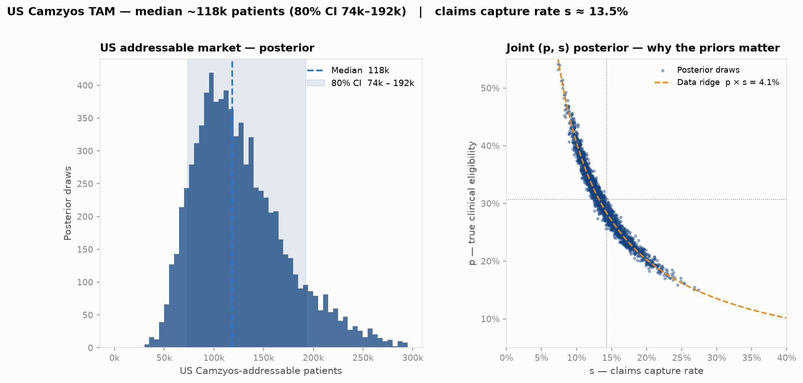

# Camzyos (mavacamten) — Adoption Dynamics and US Addressable Market

**Case study | BB Biotech | July 2026**

---

> **Abbreviations used in this document**
>
> **AUC** — area under the ROC curve (discrimination metric) | **BB** — beta-blocker | **BSS** — Brier Skill Score (calibration metric) | **CCB** — calcium channel blocker (verapamil, diltiazem) | **CI** — confidence interval | **EHR** — electronic health record | **GLM** — generalised linear model | **HCM** — hypertrophic cardiomyopathy | **HR** — hazard ratio | **LVEF** — left ventricular ejection fraction | **MRI** — magnetic resonance imaging | **NYHA** — New York Heart Association functional class | **oHCM** — obstructive HCM | **PDUFA** — Prescription Drug User Fee Act (FDA review deadline) | **REMS** — Risk Evaluation and Mitigation Strategy (FDA-mandated distribution programme) | **SRT** — septal reduction therapy (surgical or catheter-based) | **TAM** — total addressable market | **WAC** — wholesale acquisition cost

---

## Bottom line

**Task 1.** Treatment escalation history — not demographics or diagnosis codes — is the strongest predictor of Camzyos initiation in claims data (AUC 0.72, 6-feature model). The dominant signal is whether a patient has *already tried and moved past* first-line therapy (ccb_ever HR 4.69, p < 0.01), not age, sex, or symptom-burden billing codes. This is *consistent with* a prescriber-driven adoption pattern (specialists who have escalated treatment are the ones prescribing Camzyos), but it cannot be ruled out that clinical severity (LVOT gradient, NYHA class), invisible in billing data, is the true underlying driver.

**Task 2.** **~118,000 US patients** are Camzyos-addressable today, with an 80% credible interval of **74k–192k**, growing to **~200k by 2030** at the observed diagnosis rate (Butzner 2021, ~9%/yr [@butzner2021]). One PyMC model, three inputs: diagnosed HCM in the US (~400k, Butzner 2021 grown to 2024), the literature-based true eligibility rate (~30%, Desai 2022 [@desai2022]), and one ratio from our claims cohort (4% look treatable using the Task 1 markers). The claims number and the literature number disagree by ~7×; the model reconciles them by treating the claims figure as *literature × claims-capture-rate*, so both estimates can be right at once if our billing data sees roughly 1 in 7 truly eligible patients. That capture-rate insight — not the TAM itself — is the direct hand-off to Task 3.

---

## Task 1 — Who is initiating Camzyos, and when?

### The data

Synthetic US commercial claims on ~30k cardiac patients (2020–2023). The dataset contains 166 unique Camzyos (mavacamten) patients. All 166 carry an HCM diagnosis code (ICD-10 I421/I422/I429), and 90.4% (150/166) specifically carry the oHCM code (I421) — consistent with claims-based oHCM identification using a simple code-existence approach, as described in the Camzyos FDA label [@fda_camzyos_label], which defines the indication as symptomatic NYHA class II-III oHCM.

98.8% of initiators in this dataset have prior Disopyramide. The remaining ~1% without a recorded Disopyramide fill could reflect coding inconsistencies, missing claim records, or left censoring — these patients may have received Disopyramide before entering the observation window or under a different insurer, so the fill is simply not captured. Based on this, the analysis is limited to patients with Disopyramide experience (775 patients, 146 Camzyos initiators over 21 months post-launch). This is clinically motivated: Camzyos is the next-line therapy after Disopyramide failure in clinical guidelines, and Disopyramide conditioning selects the population where the prescribing decision is most relevant.

**Censoring.** Of the 775 patients: 146 initiated Camzyos (the event); 433 were administratively censored at the end of the study period (December 2023); 196 (25.3%) exited early due to enrolment gaps (loss of insurance coverage) or competing risk events. SRT (alcohol septal ablation, CPT 93583) is treated as a competing risk — 144 patients in the full dataset underwent SRT, with zero overlap with Camzyos initiators, validating the competing-risk framing. All Camzyos initiators were still on therapy at data cut, meaning the outcome is *time to initiation*, not duration of therapy.

### Train/test split: why temporal?

The dataset is split **strictly by calendar time**: months 1–12 (April 2022 – March 2023, 91 events) for training, months 13–21 (April – December 2023, 55 events) for testing. A temporal split — rather than random cross-validation — is used because it mirrors the actual deployment context: a model trained on historical data and applied to unseen future patients. In person-month panel data, random CV would additionally leak information across time points of the same patient.

### Model: discrete-time hazard GLM

**Why this model?** Patients enter and exit the risk set at different times (staggered entry, administrative censoring). A standard logistic regression would discard this timing structure. A discrete-time hazard model treats each person-month as a separate observation: "given that this patient has not yet initiated Camzyos, what is the probability they initiate *this* month?"

The complementary log-log (cloglog) link function is used because it maps directly to continuous-time proportional hazards — the coefficients are interpretable as log hazard ratios (HR), the standard effect-size measure in survival analysis.

**Baseline hazard.** Time is captured by a continuous linear trend on study month (month 1 = April 2022), not calendar-month indicator variables. Dummies would collapse to zero for unseen future months in the test set, making the model unable to extrapolate. The continuous trend allows the baseline hazard to evolve smoothly into the test window.

### Evaluation metrics

Three complementary metrics: **time-dependent AUC** (can the model rank future initiators above non-initiators within each month?), **Brier Skill Score** (are predicted probabilities better calibrated than the base rate?), and **count calibration MAE** (do predicted aggregate monthly counts match observed counts?).

### Feature engineering

Claims data is transformed into a **person-month panel**: each row represents one patient in one calendar month, and the outcome variable is a binary indicator for whether that patient initiated Camzyos in that month.

Every feature is computed using strict **as-of logic** — only information from *before* the current panel month is used. This prevents look-ahead bias. Concretely, for a row representing patient P in month M:

- **"Ever" flags** (e.g., `ccb_ever`): scans all prescription fills for patient P with a fill date in any month *strictly before* M. If at least one CCB fill exists, the flag is 1. This means the flag can flip from 0 → 1 as one moves forward in time, but never back.
- **"Current" flags** (e.g., `bb_current`): checks whether patient P has a beta-blocker fill whose coverage window (fill date + 90 days) extends into month M. A fill in month M itself is excluded. This captures whether the patient is actively managed on that drug class right now.
- **Duration measures** (e.g., `months_since_diso`): the number of calendar months between the patient's first Disopyramide fill and month M. Increases by 1 each month.
- **Counts** (e.g., `n_hcm_meds`): the number of distinct HCM guideline medications (out of 7 possible: 4 beta-blockers, 2 CCBs, Disopyramide) with at least one fill strictly before month M.

**Handling enrolment gaps.** If a patient has a gap in insurance coverage (a month where they are not enrolled), they are censored at the first gap, i.e., all subsequent person-months are dropped.

41 candidate features were constructed in total, spanning demographics (age, sex), comorbidity diagnosis codes, medication classes, and procedure history.

### Feature selection: stability selection

From the 41 candidates, stability selection [@meinshausen2010] is applied to identify features with robust predictive signal. This method is preferred over standard stepwise or LASSO selection because it controls the family-wise error rate while being robust to the choice of regularisation strength — important when the sample size is small and the risk of overfitting to noise is high. The procedure:

- **200 bootstrap resamples**, each drawing 70% of *patients* (not rows — patient-level resampling prevents leakage across person-months of the same individual)
- **L1-penalised logistic regression** fit on each subsample. The regularisation strength *C* is tuned via 5-fold cross-validation on the training set
- Features are kept if their coefficient is non-zero in **≥60% of resamples** (the Meinshausen-Bühlmann threshold for controlling family-wise error)


### Results

#### Feature selection outcome

Six features survive the ≥60% stability threshold. Lower thresholds (e.g., 50%) admit additional features, but these degrade calibration on the test set — consistent with the small sample size (~91 training events) limiting the number of parameters the data can support. 

#### Hazard ratios: which features predict initiation?


The forest plot shows the hazard ratio (HR) and 95% confidence interval for each of the six selected features. An HR > 1 means the feature *increases* the monthly probability of Camzyos initiation; HR < 1 means it *decreases* it. The reference line at HR = 1 represents no effect.

Three features are statistically significant: `ccb_ever` (HR 4.69, p < 0.01) — having ever tried a calcium channel blocker signals deeper treatment escalation and is the single strongest predictor. `bb_current` (HR 0.09, p < 0.05) and `ccb_current` (HR 0.55, p < 0.05) — being actively on cardiac medication suppresses switching. The remaining three features (`mri_ever`, `months_since_diso`, `n_hcm_meds`) have the expected direction but are not individually significant at the 5% level.

Age, sex, and symptom-burden diagnosis codes: **not predictive**. The clinical severity variables that actually drive prescribing decisions (LVOT gradient, NYHA class) are invisible in billing data — only the treatment history that preceded the decision.

#### What this means for the investment case

The "ideal candidate" profile — ever tried a CCB, currently off cardiac medications, had cardiac MRI — has an **illustrative ~50× higher monthly initiation hazard** than a patient still on beta-blockers (illustrative because of the wide CI). This spread is driven primarily by `bb_current` (HR 0.09, i.e., ~11× suppression), which has the widest CI of any feature (0.01–0.61, significant at p < 0.05).

Median time-to-initiation: ~20 months for the specialist-engaged archetype vs. effectively never for the unescalated patient. The directional conclusion — that initiation is predicted by treatment trajectory, not patient demographics — is robust. This is *consistent with* adoption being concentrated at specialist centres where clinical workup (MRI, medication escalation) precedes prescription. However, we cannot directly observe prescriber characteristics (no NPI linkage) or clinical severity (no LVOT gradient, NYHA class in billing data), so we cannot definitively separate "prescriber access" from "disease severity" as the causal driver. With NPI-linked prescriber data, this distinction would be testable.

#### How is uptake evolving over time?

**Figure: Adoption dynamics (four-panel summary)**


Monthly new starts peaked at ~10/month in late 2022, then decelerated to ~6/month by H2 2023. Cumulative penetration is modelled as an S-curve (logistic growth), the standard framework for specialty drug adoption: slow initial uptake, acceleration as awareness and prescriber confidence spread, then deceleration as the eligible pool saturates. The 21-month observation window captures only the early phase of this trajectory. A simple logistic curve (2 parameters) is used; more complex approaches such as a Bass diffusion model could be explored with additional launch data. By study end, 146/775 = 18.8% of the Disopyramide-conditioned pool had initiated.

The archetype panel (bottom left) shows the 50× spread in predicted monthly hazard across patient profiles. The risk distribution (bottom right) shows 629 remaining patients with mean hazard 1.45%/month.

**Caveat.** The synthetic dataset shows deceleration; BMS quarterly revenue filings [@bms_q4_2023; @bms_q4_2024] show acceleration ($84M Q4 2023 → $201M Q4 2024), suggesting the true trajectory is steeper.

#### Model performance

| Metric | Value | Interpretation |
|---|---|---|
| AUC | **0.72** [0.67, 0.78] | Ranks future initiators above non-initiators 72% of the time (null = 0.50). CI from patient-level test bootstrap (n=565 patients, 55 events) |
| BSS | **+0.009** | Barely above null. At ~1.5% event rate, per-patient sharpness is inherently limited |
| Count MAE | **1.7/month** | Predicted monthly counts track observed within ±2 — feeds market sizing directly |
| Hosmer-Lemeshow | **p = 0.68** | No evidence of miscalibration (p > 0.05 = predicted and observed rates agree across subgroups) |

**Where the model genuinely adds value.** The honest story: at the individual patient-month level, Camzyos initiation is rare (~1.5%) and hard to predict from billing data alone — the clinical variables that drive prescribing (LVOT gradient, NYHA class) are invisible. The BSS of +0.009 reflects this: the model barely beats the base rate on per-patient probability sharpness, and this is not claimed otherwise. The real value is twofold: (1) **discrimination** — the model reliably separates high-risk from low-risk patients (AUC 0.72), enabling archetype-based targeting; and (2) **count calibration** — the model's aggregate monthly predictions track observed counts with MAE 1.7/month, meaning the predicted hazards can feed directly into the TAM without recalibration.

**Model benchmarking.** The GLM is compared against a null baseline and a gradient-boosted survival model (Cox partial likelihood loss, scikit-survival):

| Model | AUC | BSS |
|---|---:|---:|
| Null (marginal rate) | 0.50 | −0.001 |
| **Refined GLM (cloglog)** | **0.72** | **+0.009** |
| GBM (Cox PH) | 0.69 | +0.003 |

The GLM outperforms the nonlinear GBM on both metrics, due to the small number of ~91 training events.

---

## Task 2 — How big is the US addressable market?

### The setup, in one line

> **TAM ≈ diagnosed HCM in the US × fraction of them eligible for Camzyos**

Both inputs are uncertain, and the eligible fraction has two disagreeing sources:

- **Literature:** ~30% of diagnosed HCM adults are obstructive AND symptomatic enough for a myosin inhibitor (Desai 2022 US specialty registry [@desai2022]).
- **Our claims cohort:** using the Task 1 escalation markers (obstructive HCM code I421 + Disopyramide fill — the single strongest Task 1 signal, HR 4.69), only 769 of 18,953 HCM patients (~4%) look treatable.

The two numbers differ by ~7×. Ignoring either would be indefensible. The whole Task 2 model is built to reconcile them.

### The reframe

> **The claims data does not measure who is *truly* eligible. It measures who is *coded* as eligible.**

Two patients with identical clinical pictures can look completely different in billing records — one has a well-coded chart, the other has vague codes and lives entirely in physician notes. So the 4% and 30% can both be right at once, provided the *claims capture rate* is about 1 in 7 (≈ 14%). Our data is *consistent with* that reconciliation. It doesn't independently measure the capture rate itself — a single ratio can't separate "true eligibility" from "claims capture" — but the model makes the assumption visible and defensible instead of leaving the 7× gap unexplained.

### One PyMC model, three unknowns, six lines

The whole thing is a joint Bayesian update with three parameters:

| Symbol | What it is | Prior | Prior source |
|---|---|---|---|
| `p` | true clinical eligibility | Beta(14.3, 32.3), mean 30.7% | Desai 2022 [@desai2022] |
| `s` | claims capture rate | Beta(2, 12), mean 14.3% | Claims-coding validation literature |
| `N` | diagnosed HCM in the US | LogNormal, median 400k, p95 650k | Butzner 2021 [@butzner2021], grown ~9%/yr to 2024 |
| Data | `k = 769`, `n = 18,953` | `k ~ Binomial(n, p·s)` | Task 1 markers on our cohort |

The full model, from [`src/task2_tam/tam_model.py`](../src/task2_tam/tam_model.py):

```python
with pm.Model() as model:
    p     = pm.Beta("p_true_eligibility", 14.3, 32.3)
    s     = pm.Beta("s_capture_rate",     2.0, 12.0)
    n_hcm = pm.LogNormal("n_hcm_us", mu=np.log(400_000), sigma=0.295)
    pm.Binomial("k_observed", n=n, p=p*s, observed=k)
    pm.Deterministic("tam", n_hcm * p)
```

NUTS sampler, 4 chains, r̂ = 1.00, ESS > 2,700 — clean convergence in ~2 seconds.

**Two things worth naming, because they get asked.** The magnitude of the TAM is set by `N` and `p` together — the LogNormal on diagnosed HCM and the Desai prior on eligibility do most of the numerical work (see sensitivity table: each roughly doubles the TAM across its plausible range). The claims data isn't what makes the TAM big or small; the Bayesian layer is what reconciles the 4% claims figure with the 30% literature figure without discarding either. The value is in the reconciliation, not in the magnitude.

### Results — TAM today



| Quantity | Posterior median | 80% CI |
|---|---:|---:|
| **US addressable market today** | **~118,000 patients** | **74k – 192k** |
| True clinical eligibility `p` | 30% | 22% – 39% |
| Claims capture rate `s` | 14% | 10% – 18% |
| Diagnosed HCM in the US `N` | 397,000 | 273k – 583k |

**How to read the figure.** *Right panel:* the orange curve is what the data alone constrains — combinations of `(p, s)` whose product equals the observed 4.1%. Posterior samples sit on it; the priors (dotted grey lines, marking their means) pick where on it. *Left panel:* the TAM = `N × p` posterior. At Camzyos' WAC (~$90k/year), the low end of the 80% CI already implies a >$6B annual US opportunity at peak penetration.

**The calibration insight** — arguably more actionable than the TAM itself — is that our claims database sees roughly 1 in 7 truly eligible patients. That's the direct hand-off to Task 3: a chart-review validation subsample would independently pin `s` and convert the model from prior-driven identification into evidence-driven inference. Single highest-value data acquisition for closing TAM uncertainty.

### TAM over time

The pool grows because diagnosis grows. Butzner 2021 [@butzner2021] documents ~1.5× growth in diagnosed HCM 2013→2019 (~9%/yr). Propagating that growth rate through the posterior — `TAM(year) = N × (1+g)^(year − 2024) × p` — gives:

| Growth rate | 2024 | 2027 | 2030 |
|---|---:|---:|---:|
| 5%/yr (conservative) | ~118k (74–192) | ~137k (85–223) | ~159k (99–258) |
| **9%/yr (Butzner base case)** | **~118k (74–192)** | **~153k (95–249)** | **~198k (124–323)** |
| 12%/yr (aggressive) | ~118k (74–192) | ~166k (104–270) | ~234k (145–380) |

Numbers are medians with 80% CI. Full CSV: [`09_tam_over_time.csv`](../outputs/task2_tam/09_tam_over_time.csv). Under the base case, the TAM approaches ~200k by 2030 — a ~70% expansion of the reachable pool over six years driven entirely by diagnostic ascertainment.

**A note on scope.** This is a projection of the *eligible pool*, not a Camzyos-on-drug forecast. The latter is a diffusion question (peak penetration, ramp shape, aficamten share of new starts) that needs 4+ years of launch data to anchor — deliberately excluded. As reference: BMS US Camzyos revenue was $84M Q4 2023 [@bms_q4_2023] and $201M Q4 2024 [@bms_q4_2024], implying ~10–15k patients on drug by end-2024, or ~10% of the TAM's lower bound. Plenty of room to grow.

### Sensitivity — how much do the priors matter?

Re-running the same PyMC model under alternative priors ([`09_tam_prior_sensitivity.csv`](../outputs/task2_tam/09_tam_prior_sensitivity.csv)):

| Prior scenario | TAM median | 80% CI |
|---|---:|---:|
| **Base case** (Desai `p`, coding-lit `s`, Butzner `N`) | **120k** | **74k – 189k** |
| Bull: `p` mean shifted to 40% | 158k | 102k – 245k |
| Bear: `p` mean shifted to 20% | 85k | 51k – 140k |
| `s` more diffuse (weaker prior) | 119k | 75k – 187k |
| `s` chart-review-tight (Beta(20, 120)) | 116k | 78k – 180k |
| `N` low (median 300k) | 89k | 55k – 145k |
| `N` high (median 550k) | 164k | 102k – 261k |

Two takeaways: (1) the TAM is roughly linear in both `p` and `N` — the two biggest levers — while `s` mostly rearranges the identification of `p`; (2) the base case sits comfortably in the middle of the range, and the full sweep spans ~50k to ~260k. Any point estimate presented without a range from this table is a false-precision claim.

---

## What would change our view

Ranked by size of impact on the TAM:

1. **Diagnosed HCM count `N`** — the single largest lever. Halving `N` roughly halves the TAM. BB Biotech's IQVIA/Symphony/Komodo subscription can measure this directly against a 30M-life denominator; the current prior is an extrapolation from Butzner 2019.
2. **True eligibility `p`** — the community-vs-referral coding gap [@charron2024; @osman2025; @butzner2026] means literature spans 20–42%. Sensitivity table shows this range moves the TAM from ~85k to ~160k.
3. **Claims capture rate `s`** — pins where on the identifiability ridge we sit. A chart-review validation sample is the direct evidence upgrade.
4. **REMS monitoring relaxation** — bullish for reach, not modelled in the static TAM.
5. **nHCM label expansion** — excluded from base case. If ODYSSEY-HCM were positive (reportedly negative on primary — verify), the eligible pool roughly doubles.
6. **Medicare gross-up** — our `N` prior is anchored on commercial claims that undercount the ≥65 population; age-stratified Medicare data could lift the TAM by 30–40%.

---

## Limitations

- **Synthetic data artefact.** The 98.8% Disopyramide→Camzyos co-occurrence in this dataset is much higher than real-world rates (60–75%), inflating in-sample conversion by ~25%. This means the model's conversion rate and archetype hazards are calibrated to this synthetic pattern — coefficients would shift with real claims data, though the direction and ranking of features would likely hold.
- **No prescriber granularity.** REMS certification is likely the single strongest predictor of Camzyos initiation, but it is a prescriber-level attribute invisible in patient-level claims data without NPI linkage. The `mri_ever` feature partially proxies for specialist access, but imperfectly.
- **Small sample size constrains model complexity.** With ~91 training events, the model is limited to 6 features. Interaction terms, nonlinear effects, and time-varying coefficients are all plausible but would overfit. The GBM benchmark (nonlinear, same features) did not improve discrimination, suggesting the linear model captures the available signal.
- **Claims data only — no clinical detail.** Claims capture billing events, not clinical reality. The variables that actually drive prescribing decisions — LVOT gradient, NYHA functional class, echocardiographic findings — are invisible. Linking to EHR data (e.g., IQVIA EHR Linked, TriNetX, Truveta) would unlock clinical risk factors such as resting gradient >30 mmHg and NYHA III vs. II classification that likely dominate the treatment decision but cannot be observed in billing data alone.
- **US commercial claims only.** Medicare/Medicaid populations (≥65, low-income) are underrepresented, and oHCM prevalence increases with age — our diagnosed-HCM prior `N` likely underestimates the true count by 30–40%. Ex-US markets (~10% of worldwide revenue today) are not modelled.
- **Two unverified citations.** Butzner 2026 [@butzner2026] (DOI paywalled at time of analysis); ODYSSEY-HCM nHCM outcome (from external context only — verify with KOL network before citing in IC materials).

## What I would change with more time or data

**With BB Biotech's real data subscription (1 week):**
1. **Replace synthetic data with MarketScan.** Collapses the 98.8% Disopyramide artefact, gives 500–2,000 Camzyos initiators (10× current sample), supports 20+ features without overfitting, and enables subgroup analyses by payer, geography, and prescriber volume.
2. **NPI-linked prescriber data.** Separates "prescriber access grows" from "eligible patients grow" — these have different investment implications. Could directly model REMS certification as a feature.
3. **Verified BMS Q4 2025 revenue + Cytokinetics NDA status.** Confirm aficamten PDUFA timing and update the competitive-share prior with a BB Biotech house view rather than an external default.

**With more modelling time (1–2 weeks):**
4. **Broader feature engineering.** With a larger sample, interaction terms (e.g., `ccb_ever × mri_ever`), time-varying coefficients, richer comorbidity features, and provider-level variables could be explored. At n=91 events, each additional feature degrades calibration; at n=500+, the calculus reverses.
5. **Alternative feature selection methods.** Compare stability selection against recursive feature elimination (RFE), Boruta, or permutation importance to assess whether the 6-feature set is robust to the selection method, not just the data resampling.
6. **Hyperparameter tuning and model comparison.** With more events, nested temporal CV (expanding-window) becomes feasible for systematic hyperparameter search. Nonlinear models — discrete-time survival forests, gradient-boosted Cox — could then be benchmarked fairly rather than overfitting as they do at current sample size.

None of these change the *framework* — they only tighten the priors and extend the scope. The pipeline is designed so that better data drops into the same Monte Carlo structure with updated distributions.

---

**Tools.** Coding and pipeline development: [Claude Code](https://claude.ai/code). Writing and document refinement: [Claude Desktop](https://claude.ai). Literature research and prior sourcing: [Elicit](https://elicit.com). All modelling decisions and analytical judgements are the author's.

---

## References

All quantitative claims are grounded in either our analysis pipeline (reproducible via `notebooks/02_camzyos_analysis.ipynb`) or the cited sources below. Task 2 model: [`src/task2_tam/tam_model.py`](../src/task2_tam/tam_model.py). Prior sensitivity: [`outputs/task2_tam/09_tam_prior_sensitivity.csv`](../outputs/task2_tam/09_tam_prior_sensitivity.csv).

::: {#refs}
:::
