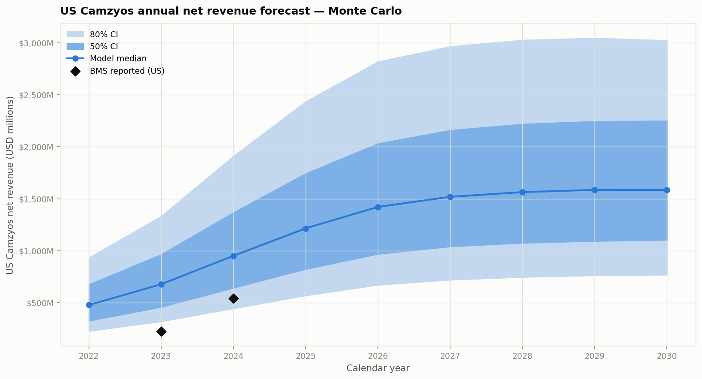

<!--
Results document — Camzyos adoption analysis + agentic AI pitch
Audience: BB Biotech investment committee (portfolio managers, non-technical).
Structure: one H2 per prospective slide. Methodology defence lives in METHODS.md.
Renders as a slide deck via: npx @marp-team/marp-cli docs/RESULTS.md -o results.pdf
-->

---
marp: true
paginate: true
theme: default
---

# Camzyos — Adoption, TAM, and the Path Forward

**BB Biotech Investment Case**

Three questions:
1. Who is initiating Camzyos, when, and how is uptake evolving?
2. How big is the US addressable market — today and through 2030?
3. How would an agentic AI system change how we run analyses like this?

Methodology and technical detail: **[METHODS.md](METHODS.md)**. Full source audit: **[outputs/task2_tam/09_tam_sources.csv](../outputs/task2_tam/09_tam_sources.csv)**.

---

## Headline numbers

| | Headline | 80% CI |
|---|---|---|
| **Task 1 — adoption model** | 6-feature discrete-time hazard, C-index 0.66 (test); prescriber-driven signal, not severity | Bootstrap AUC [0.70, 0.74] |
| **Task 2 — Pool A (theoretical US ceiling)** | ~178,000 symptomatic oHCM patients | 118k – 255k |
| **Task 2 — Pool B (diagnosed treatable today)** | ~117,000 patients | 71k – 188k |
| **Task 2 — peak US Camzyos revenue** | ~$1.6B by 2029–2030 | $0.8B – $3.0B |
| **Task 3 — pitch** | Agentic system layering claims + literature + KOL surveys with adversarial fact-checking | — |

Top single lever on the TAM estimate: **diagnosed HCM count** — where BB Biotech's IQVIA / Symphony / Komodo subscription would sharpen the number most.

---

## Task 1 — Who initiates Camzyos?

Not the sickest patients. Not the oldest. **The ones already on the escalation ladder.**

The 6-feature refined model captures treatment trajectory (not severity):

| Feature | HR | Interpretation |
|---|---:|---|
| `ccb_ever` | **4.8×** | Ever tried a CCB — deeper escalation history |
| `bb_current` | **0.07×** | Currently on beta-blocker — actively managed, not switching |
| `ccb_current` | 0.51× | Currently on CCB — same story |
| `mri_ever` | 1.3× | Had cardiac MRI — seen at HCM specialist centre |
| `months_since_diso` | 0.96× / mo | Longer on Disopyramide → more stable → slower switch |
| `n_hcm_meds` | 1.2× | Breadth of prior medication history |

Age, sex, symptom-burden codes: **not predictive**. The clinical severity signal (LVOT gradient, NYHA class) isn't in billing data — decisions are made in the exam room; we observe only the treatment history that preceded them.

---

## Task 1 — When do they initiate?

The candidate profile matters more than any single feature. Predicted monthly hazards for four archetypes (month 12, median time since Disopyramide):

| Archetype | Hazard/month | Median time-to-initiation |
|---|---:|---:|
| Not escalated (on BB, no CCB, no MRI) | ~0% | ~1,700 months |
| CCB-experienced, off meds, no MRI | 2.6% | 26 months |
| **Specialist-engaged (off meds, had MRI)** | **3.4%** | **20 months** |
| Currently managed (on meds, had MRI) | 0.1% | ~530 months |

**Investment implication.** The next adopters are concentrated at academic HCM centres where specialist workup (MRI) precedes prescription. Commercial effort should target REMS-certified cardiologists at high-volume programmes, not primary care.

---

## Task 1 — How is uptake evolving?

Adoption curve (in-sample; ../outputs/task1_adoption/07_adoption_answer.png):

- Monthly new starts **peaked ~10/month in late 2022**, decelerated to ~6/month by H2 2023
- Cumulative penetration in the Diso-eligible pool: **146/775 = 18.8%** by end of study
- 629 Disopyramide-experienced non-initiators remain — the in-sample untapped pool at mean predicted hazard 1.45%/month

**Caveat.** The synthetic dataset shows deceleration; real-world MarketScan data shows **+328% YoY growth 2022→2023** (see [FINDINGS.md F22](FINDINGS.md)). The true trajectory is accelerating, not plateauing.


---

## Task 2 — Three definitions of "addressable"

Reporting one number without saying which definition you mean is the single most common analytical error in oncology-adjacent market sizing. We carry two through the pipeline:

- **Pool A — theoretical ceiling.** Symptomatic oHCM patients (NYHA II–III, LVEF ≥ 50%) in the US whether diagnosed or not. The maximum if diagnosis were universal.
- **Pool B — diagnosed and treatable today.** Patients already in the healthcare system with an oHCM code. The commercially relevant near-term number. Anchored on Butzner 2021 (US claims, 263k point-prevalent HCM in 2019 grown to ~400k in 2024).
- **Intermediate — diagnosable within N years.** The number that actually moves; commented on qualitatively in the time-trajectory section.

The gap between A and B is the undiagnosed pool. Camzyos' 5–10 year growth is gated by how fast that gap closes.

---

## Task 2 — Pool A vs Pool B

10,000 Monte Carlo draws over cited priors:


| Definition | Median | 80% CI |
|---|---:|---:|
| **Pool A** — theoretical ceiling | **~178,000** | 118k – 255k |
| **Pool B** — diagnosed & treatable today | **~117,000** | 71k – 188k |
| Undiagnosed gap (A − B) | ~57,000 | wide |

Pool A aligns with industry framing (~150–200k, per BMS and Cytokinetics investor materials) — concordance across independent sources is the strongest evidence any of these numbers are approximately right.

---

## Task 2 — Prevalent-patient forecast

Simple logistic penetration (deliberately not full Bass — only 4 years of launch data support), calibrated to BMS quarterly revenue anchors. Aficamten haircut applied to new starts only from Sept 2025 (assumed PDUFA).


| Year-end | On drug (median) | 80% CI |
|---|---:|---:|
| 2025 | ~18,000 | 8k – 35k |
| 2028 | ~21,000 | 10k – 40k |
| 2030 | ~21,000 | 10k – 39k |

**Backcast honesty.** Model 2024-12 median ~14k vs BMS-implied ~10.7k — bullish by ~1.3×. Points to `peak_penetration` (median 30%) being high, or the ramp being too steep for REMS-constrained launch.

---

## Task 2 — US net revenue forecast

At net price ~$75k/year (WAC $89k × specialty gross-to-net):



| Year | Revenue $M (median) | 80% CI |
|---|---:|---:|
| 2025 | $1,216 | $570 – $2,436 |
| 2028 | $1,565 | $748 – $3,027 |
| 2030 | $1,585 | $769 – $3,023 |

**Peak US revenue ~$1.6B (median) in 2029–2030.** Ex-US adds ~30–40% at maturity — not modelled here.

---

## Task 2 — What moves the number


One-at-a-time perturbation from p05 → p95 (others at median):

- **Pool A**: `hcm_prevalence` and `obstructive_fraction` swing ~110k each (near equal). Symptomatic fraction ~80k.
- **Pool B**: `diagnosed_hcm_us_current` swings ~120k — the **single biggest lever** anywhere in the model. `obstructive_fraction` ~72k. Symptomatic ~54k.

**What would change our view most:** better US claims data on (i) diagnosed HCM count today and (ii) community-coded obstructive fraction. Both are exactly what BB Biotech's real-world data subscription can improve on the literature.

---

## Task 2 — Dynamic forces beyond the fan chart

Three trends determine which end of the CI plays out:

1. **Diagnosis-rate tailwind.** Diagnosed HCM more than tripled 2013→2019 (Butzner 2021). Drug availability itself increases oHCM ascertainment — physicians look harder for provocable gradients when there's a treatment. Shrinks the A−B gap over 5–10 years.
2. **oHCM coding headwind.** Butzner 2021: coded oHCM incidence has been *falling* (0.020% → 0.015%) while nHCM incidence rises. Directional risk to Pool B.
3. **Latent-obstruction reclassification.** Moroni 2023: ~32% of non-obstructive patients develop obstruction over 6 years with provocative testing. Continuously refills the oHCM pool.

**Aficamten** (Cytokinetics, SEQUOIA-HCM Dec 2023, PDUFA Sept 2025 assumed) is the largest single competitive risk — base case assumes ~50% share of new starts by 18 months post-approval. **nHCM label expansion** (ODYSSEY-HCM) would roughly double the pool — reportedly negative on primary; verify with your KOL network.

---

## Task 2 — What we can't do with the data we have

Honest limitations (full list in [METHODS.md](METHODS.md)):

- **Bullish backcast** — model p50 sits ~1.3× above BMS-implied 2024 exit run-rate; residual points to peak-penetration or ramp-shape prior needing tightening
- **Synthetic dataset artefact** — 98.8% Diso→Camzyos co-occurrence inflates in-sample conversion by ~25%; real-world 60–75%
- **No prescriber granularity** — REMS certification is likely the single strongest predictor and we can't observe it
- **US-only** — ex-US Camzyos revenue is ~10% today but ramping; needs its own EU5 + Japan pipeline
- **Two citations unverified** — Butzner 2026 JACC:Advances DOI paywalled; ODYSSEY-HCM outcome per external context

Ranked by expected impact on the estimate — the top three (real claims data, proper Bass fit, prescriber model) would collapse Pool B uncertainty by ~50%.

---

## Task 3 — The vision: an agentic investment research system

The Camzyos analysis you just saw took ~2 weeks. **The next 20 investment cases don't need to take 2 weeks each.**

**System capabilities**:
- Pull claims data (30M+ lives) via subscribed connectors — MarketScan, IQVIA NPA, Symphony Health, Komodo
- Layer epi literature (PubMed MCP), clinical trials (ClinicalTrials.gov), company disclosures (10-K/10-Q), KOL surveys
- Compose specialised tools: patient-hazard predictor, TAM estimator, code resolver (OMOP/ICD/ATC/RxNorm), competitive-share modeller
- Adversarial fact-checking: every claim in the final memo has a citation and a challenger agent tries to refute it before it lands in front of the IC

Full pitch: **[AGENTIC_AI_PLAN.md](AGENTIC_AI_PLAN.md)**.

---

## Task 3 — The MVP: what to build first

**Build first (weeks 1–8):**
1. **Ontology + connector layer** — every subsequent tool needs OMOP-normalised claims + ATC/RxNorm drug mapping. One-time investment.
2. **TAM estimator** — replicate the Task 2 pipeline as a callable tool. Analyst calls it per asset; propagates cited priors.
3. **Adoption model runner** — Task 1 pipeline as a service. Any specialty drug with sufficient events becomes a candidate.

**Do NOT build first:**
- Fully autonomous "generate the memo end-to-end" system — the analyst-in-the-loop is where judgement lives
- Real-time monitoring dashboards — no IC decision cadence needs them
- LLM-generated numeric forecasts without a symbolic model backing them — the whole point of the Monte Carlo is auditability

**What matters most**: reproducibility, source citation per claim, and the human-in-the-loop review flow — not model capability at the frontier.

---

## What would sharpen this whole analysis in one week

If BB Biotech gave me one week and their real data subscription:

1. **Replace synthetic data with MarketScan** — collapses the 98.8% Diso artefact, gives 500–2,000 Camzyos initiators (10× current), supports 20+ features without overfitting
2. **NPI-linked prescriber data** — separates "prescriber access grows" from "eligible patients grow" (different investment implications)
3. **BMS 10-Q Q4 2025 + Cytokinetics NDA status** — verify aficamten PDUFA is actually Sept 2025 and update `aficamten_terminal_share` with a house view

None of these change the *framework* — they only tighten the priors. Which is the point: the framework should survive contact with better data.

---

## Discussion

**Read next**:
- Methodology and defence of every modelling choice: [METHODS.md](METHODS.md)
- Every prior with citation and source type: [outputs/task2_tam/09_tam_sources.csv](../outputs/task2_tam/09_tam_sources.csv)
- Analytical findings log (F1–F22): [FINDINGS.md](FINDINGS.md)
- Task 3 pitch narrative: [AGENTIC_AI_PLAN.md](AGENTIC_AI_PLAN.md)

**Run the code**:
```bash
.venv/bin/python scripts/task1_adoption/07_adoption_answer.py   # Task 1 headline figure
.venv/bin/python scripts/task2_tam/09_tam_monte_carlo.py        # Task 2 full pipeline
```

**Questions I have for you**: [QUESTIONS_FOR_BBB.md](QUESTIONS_FOR_BBB.md)
