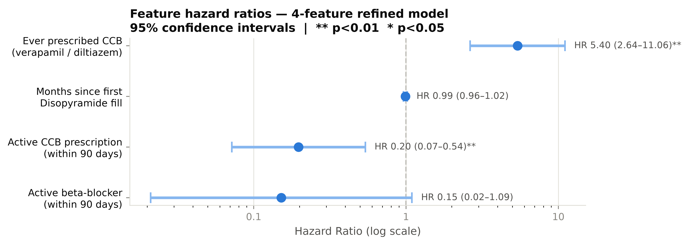
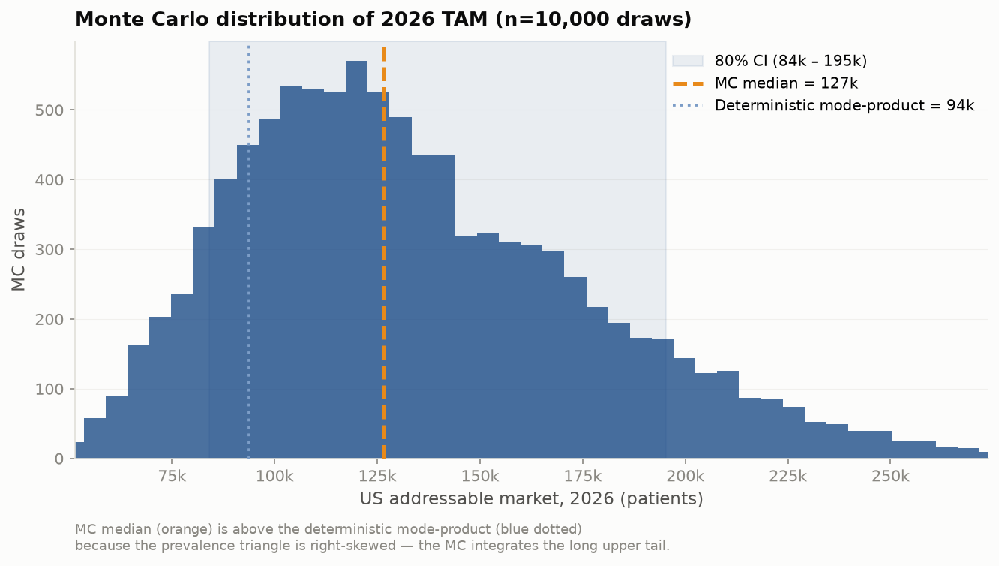

# Camzyos (mavacamten) — Adoption Dynamics and US Addressable Market

**Case study | BB Biotech | July 2026**

---

> **Abbreviations used in this document**
>
> **AUC** — area under the ROC curve (discrimination metric) | **BB** — beta-blocker | **BSS** — Brier Skill Score (calibration metric) | **CCB** — calcium channel blocker (verapamil, diltiazem) | **CI** — confidence interval | **EHR** — electronic health record | **GLM** — generalised linear model | **HCM** — hypertrophic cardiomyopathy | **HR** — hazard ratio | **LVEF** — left ventricular ejection fraction | **MRI** — magnetic resonance imaging | **NYHA** — New York Heart Association functional class | **oHCM** — obstructive HCM | **PDUFA** — Prescription Drug User Fee Act (FDA review deadline) | **REMS** — Risk Evaluation and Mitigation Strategy (FDA-mandated distribution programme) | **TAM** — total addressable market 

---

## Summary

**Task 1.** Treatment escalation history is the strongest predictor of Camzyos initiation in claims data (AUC 0.72). The dominant signal is whether a patient has *already tried and moved past* first-line therapy (ccb_ever HR 5.40, p < 0.001; 4-feature model), not age, sex, or symptom-burden billing codes. However, it cannot be ruled out that clinical severity (LVOT gradient, NYHA class), invisible in billing data, is the true underlying driver.

**Task 2.** **~127k US patients** are Camzyos-addressable today (80% CI **84k–195k**), plausibly reaching **~137k–169k by 2030** across growth scenarios (base case ~152k). A transparent top-down epidemiological funnel: `TAM = US adults × diagnosed HCM prevalence × Camzyos-eligible fraction`, each factor a triangular distribution over published bounds with Monte Carlo propagation. 

---

## Task 1 — Who is initiating Camzyos, and when?

### The data

Synthetic US commercial claims on ~30k cardiac patients (2020–2023) that contain 166 unique Camzyos (mavacamten) patients. The Camzyos FDA label [@fda_camzyos_label] defines the indication as symptomatic NYHA class II-III oHCM; the primary oHCM ICD-10 code, I42.1, is present for 90.4% (150/166) of the patients. The remaining patients have at least an adjacent code (I42.2, I42.9) present and are included as well. Symptoms are typically only insufficiently coded in claims data and NYHA class are not available in billing data. Therefore, NYHA class II-III cannot be reliably determined to identify symptomatic NYHA class II-III oHCM reliably. 

98.8% of Camzyos initiators in this dataset have been prescribed Disopyramide before. The remaining ~1% without a recorded Disopyramide prescription could reflect coding inconsistencies, missing claim records, or left censoring: these patients may have received Disopyramide before entering the observation window or under a different insurer. Based on this, the analysis is limited to patients with Disopyramide experience (775 patients, 146 Camzyos initiators over 21 months post-launch) and all Camzyos patients. All Disopyramide patients have at least one of I42.1, I42.2, or I42.9, and mirror the diagnosis inclusion criteria for the Camzyos patients. Camzyos is the next-line therapy after Disopyramide failure in clinical guidelines, but this conditioning on Disopyramide could be a selection bias in our current dataset as the label does not require a Disopyramide prescription before Camzyos.

**Censoring.** Of the 775 patients: 146 initiated Camzyos (the event); 433 were administratively censored at the end of the study period (December 2023); 196 (25.3%) exited early due to enrolment gaps (loss of insurance coverage) or competing risk events. SRT (septal reduction therapy — alcohol septal ablation, CPT 93583) is a **procedural alternative** to Camzyos for symptomatic oHCM: instead of starting the drug, the thickened septum is physically thinned. Patients who choose SRT leave the pool of potential Camzyos starters, so SRT is modelled as a competing risk — those patients are removed from the at-risk set at the SRT date, rather than being treated as if they might still initiate Camzyos later. 144 patients in the full dataset underwent SRT with zero overlap with Camzyos initiators, confirming the two treatment paths are mutually exclusive in practice. All Camzyos initiators were still on therapy at data cut, so the outcome modelled is time to initiation, not duration of therapy.

### Train/test split

The dataset is split strictly by calendar time: months 1–12 (April 2022 – March 2023, 91 events) for training, months 13–21 (April – December 2023, 55 events) for testing. A temporal split, rather than random splitting, is used because it reflects the actual deployment context: a model trained on historical data and applied to unseen future patients. Random splitting would additionally leak information across time points.

### Model: discrete-time hazard GLM

Patients enter and exit the risk set at different times (staggered entry, administrative censoring). A standard logistic regression would discard this timing structure. A discrete-time hazard model treats each person-month as a separate observation: "given that this patient has not yet initiated Camzyos, what is the probability they initiate this month?" The outcome variable is a binary indicator for whether that patient initiated Camzyos in that month.

A log-log (cloglog) link function is used because it maps directly to continuous-time proportional hazards and the coefficients are interpretable as log HR, the standard effect-size measure in survival analysis.

Time is captured by a continuous linear trend on study month (month 1 = April 2022), not calendar-month indicator variables. The continuous trend allows the baseline hazard to evolve smoothly into the test window.

### Evaluation metrics

Three complementary metrics are evaluated: **time-dependent AUC** (can the model rank future initiators above non-initiators within each month?), **Brier Skill Score** (are predicted probabilities better calibrated than the base rate?), and **count calibration MAE** (do predicted aggregate monthly counts match observed counts?).

### Feature engineering

Every feature is computed using only information from **months strictly before the current one** — no look-ahead bias. The four feature types:

- **"Ever" flags** (e.g., `ccb_ever`): 1 if the patient has any prior CCB fill on record, else 0.
- **"Current" flags** (e.g., `bb_current`): 1 if the patient has an active beta-blocker prescription — a prior fill whose 30-day coverage window overlaps the current month. Fills in the current month itself are excluded.
- **Duration measures** (e.g., `months_since_diso`): calendar months elapsed since the patient's first Disopyramide fill; increments by 1 each month.
- **Counts** (e.g., `n_hcm_meds`): number of distinct HCM guideline medications (of 7 possible — 4 beta-blockers, 2 CCBs, Disopyramide) with at least one prior fill.

**Handling enrolment gaps.** If a patient has a gap in insurance coverage (a month where they are not enrolled), they are censored at the first gap, i.e., all subsequent person-months are dropped.

25 candidate features were constructed in total, spanning demographics (age, sex), comorbidity diagnosis codes, medication classes, procedure history, and rare label-derived composites (contraindications, dual-drug flags).

The clinical severity variables that are relevant for prescribing decisions (LVOT gradient, NYHA class) are not available in billing data.

### Feature selection: pre-filter + stability selection

Selection runs in two stages, a frequency filter and stability selection. Due to the small sample size, the choices for robust feature selections are restricted and the goal is to find few, but predictive features.

**Stage 1 — pre-filter (25 → 14 candidates).** Rare features are dropped. Features such as `cyp_inhibitor_active`, `diso_ccb_combo_current`, and `dual_bb_ccb_current` all have <1% person-month prevalence.

The 14-feature candidate pool includes demographics, comorbidity flags, all beta-blocker/CCB history features, Disopyramide adherence (MPR), months since first Disopyramide fill, months since last HCM med change, prior MRI, and 12-month rolling counts of echocardiograms, symptom diagnoses, and cardiac workup procedures.

**Stage 2 — stability selection [@meinshausen2010] on the 14 candidates.** Preferred over standard stepwise or LASSO because it improves selection robustness:

- **200 bootstrap resamples**, each drawing 70% of patients to prevent leakage across person-months of the same individual.
- **L1-penalised logistic regression** on each subsample. The regularisation strength *C* is tuned once, on the full training set, via **patient-level `GroupKFold` cross-validation**.
- Features are kept if their coefficient is non-zero in ≥60% of resamples. The selection probability threshold ($\pi_{thr}$) typically lies in the range $$\pi_{thr} \in (0.6, 0.9)$$ [@meinshausen2010].

### Results

#### Feature selection outcome

The 14 candidates rank as follows (patient-`GroupKFold`, C=0.13):

::: {.feature-rank}

| Rank | Feature | Selection probability |
|---:|---|---:|
| 1 | `ccb_ever` | 1.00 |
| 2 | `bb_current` | 1.00 |
| 3 | `ccb_current` | 0.92 |
| 4 | `months_since_diso` | 0.81 |
| *— threshold 0.60 —* | | |
| 5 | `mri_ever` | 0.59 |
| 6 | `af_flag` | 0.43 |
| 7 | `months_since_last_med_change` | 0.30 |
| 8 | `n_hcm_meds` | 0.28 |
| 9–14 | age, sex, hf_flag, bb_ever, mitral_flag, diso_mpr_12m | ≤ 0.19 |

:::

The final model contains the set of features passing the 0.60 threshold: **`ccb_ever`, `bb_current`, `ccb_current`, `months_since_diso`**.

#### Hazard ratios: which features predict initiation?



The forest plot shows the HR and 95% CI for each of the four refined features. An HR > 1 means the feature increases the monthly probability of Camzyos initiation; HR < 1 means it decreases it. The reference line at HR = 1 represents no effect.

Two of the four features are statistically significant at the 5% level: `ccb_ever` (HR 5.40, 95% CI 2.64–11.06, p < 0.001) — having ever tried a calcium channel blocker signals deeper treatment escalation and is the single strongest predictor. `ccb_current` (HR 0.20, 95% CI 0.07–0.54, p = 0.002) — being actively on a CCB suppresses switching in the current month. `bb_current` (HR 0.15, 95% CI 0.02–1.09, p = 0.061) has the expected protective direction but is borderline significant with a wide CI, consistent with the small number of person-months where a patient is actively on a beta-blocker within the 30-day coverage window. `months_since_diso` (HR 0.99 per month, p = 0.53) is not individually significant at the 5% level. This feature could be removed in future versions.


The patient profile/archetype that has ever tried a CCB and is currently off both beta-blockers and CCBs has the highest monthly initiation hazard compared to an unescalated patient still actively on a beta-blocker.

Median time-to-initiation: ~26 months for the escalated-off-meds archetype vs. effectively never (>1000 months) for the unescalated patient. The conclusion that initiation is predicted by treatment trajectory is robust across every configuration in the feature-selection sweep.

#### How is uptake evolving over time?


Monthly new starts averaged ~10/month through late 2022 (with a Dec 2022 spike to 15) and decelerated to ~6/month in H2 2023. Cumulative penetration is modelled as an S-curve (logistic growth), a commonly used framework for specialty drug adoption: slow initial uptake, then deceleration as the eligible pool saturates. The 21-month observation window captures only the early phase of this trajectory. By study end, 146/775 = 18.8% of the Disopyramide-conditioned pool had initiated Camzyos.

The archetype panel (bottom left) shows the spread in predicted monthly hazard across patient profiles. The risk distribution (bottom right) shows 629 remaining patients with mean hazard 1.50%/month.

**Caveat.** The synthetic dataset shows deceleration; however, BMS quarterly revenue filings [@bms_q4_2023; @bms_q4_2024] show acceleration ($84M Q4 2023 to $201M Q4 2024), suggesting the true trajectory is still accelerating/positive.

#### Model performance

::: {.model-perf}

| Metric | Value | Interpretation |
|---|---|---|
| AUC | **0.72** [0.66, 0.77] | Ranks future initiators above non-initiators 72% of the time (null = 0.50). |
| BSS | **+0.009** [+0.004, +0.012] | Barely above null. At ~1.5% event rate, per-patient predictive power is inherently limited. |
| Count MAE | **1.7/month** [1.5, 3.7] | Predicted monthly counts track observed within ~2. |
| Hosmer-Lemeshow | **p = 0.21** | No evidence of miscalibration (p > 0.05 = predicted and observed rates agree across subgroups). |

:::

**Model benchmarking.** The GLM is compared against a null baseline (AUC: 0.50, BSS: −0.001) and a gradient-boosted survival model (Cox partial likelihood loss, scikit-survival):

::: {.model-bench}

| Model | AUC | BSS |
|---|---:|---:|
| **Refined GLM (cloglog, 4 features)** | **0.72** [0.66, 0.77] | **+0.009** [+0.004, +0.012] |
| GBM (Cox PH, same features) | 0.69 [0.64, 0.74] | +0.002 [−0.003, +0.004] |
| Full feature set GLM | 0.68 [0.61, 0.74] | +0.005 [−0.003, +0.013] |

:::

The refined GLM outperforms both the nonlinear GBM and the full feature set GLM on both metrics. The small event count (~91) is the limitation for model complexity, and the pre-filter + stability step is what helps to create a simple but robust model.

### Conclusion
At the individual patient-month level, Camzyos initiation is rare (~1.5%) and hard to predict from claims data alone since the clinical variables (LVOT gradient, NYHA class) that might drive prescription decisions are invisible. The BSS of +0.009 reflects this: the model barely beats the base rate on per-patient predictive power. However, the model reliably separates high- from low-risk patients (AUC 0.72) and identifies a subset with substantially elevated initiation risk — the escalated-off-meds profile has a median time-to-initiation of ~26 months versus effectively never for unescalated patients. This enables profile-based targeting even when individual-month probabilities remain uncertain; aggregate monthly predictions also track observed counts within MAE 1.7/month.

---

## Task 2 — How big is the US addressable market?

A top-down epidemiological funnel chains published fractions from the whole US adult population down to the Camzyos-eligible pool. Where two credible sources disagree on the same fraction, both bounds are used as the range of a triangular distribution rather than picking a winner. Monte Carlo simulation then propagates the joint uncertainty to a TAM distribution.

**Why not reuse the Task 1 panel.** The dataset from Task 1 has ~30k cardiac patients whose selection criteria are unspecified. There is no sampling fraction, so no panel count can be scaled to a national level. A top-down funnel must anchor on numbers that carry a US denominator (Census, published US prevalence studies).

### Method

The addressable market is the product of three quantities:

```
TAM  =  US adults  ×  diagnosed HCM prevalence  ×  Camzyos-eligible fraction
```

Each fraction is uncertain and published sources disagree. The following procedure is used to incorporate varying sources:

1. For each parameter, collect the published estimates.
2. Fit a **triangular distribution** with `min` = lowest defensible value, `mode` = central/most-cited value, `max` = highest defensible value. **Wider disagreement between sources → wider triangle.**
3. Draw 10,000 Monte Carlo samples, multiply through the funnel, report the resulting TAM distribution.

Triangular distributions are the standard choice when only min/mode/max are known.

### Data, assumptions, and parameters

**Funnel inputs.** Three directly cited sources per parameter; no growth adjustment applied to the 2026 baseline — temporal and geographic variation is captured by the triangle width.

::: {.funnel-inputs}

| Parameter | Min | Mode | Max | Source | Rationale |
|---|---:|---:|---:|---|---|
| **US adults (2026)** | — | **264M** | — | US Census | 2026 projection from ACS 2024 (~261M adults 20+); ~0.5% uncertainty negligible vs other inputs |
| **HCM prevalence (/100k)** | **70** | **80** | **200** | [@husser2018] / [@butzner2021] / [@massera2023] | Germany '15 claims (0.07% = 1/1,372) / US '19 HIRD / imaging-phenotype ceiling (~1:500, biological cap if underdiagnosis fully eliminated) |
| *Intermediate: obstructive share* | 0.49 | 0.60 | 0.70 | [@schultze2022] / [@batzner2019] | UK/Germany pop. estimates (68% UK, 49% DE) / review (~70%). Mode = midpoint of "half-to-two-thirds" range |
| *Intermediate: NYHA II-III share* | 0.45 | 0.74 | 0.92 | [@butzner2026] / [@wang2023] / [@charron2026] | Claims 53/117 (imperfect ICD sensitivity, includes some NYHA IV) / US HCP cohort II+III = 74.2% (excl. I 20%, IV 5.7%) / France registry II+III = 92% (excl. IV 4%) |
| **= Camzyos-eligible fraction** | **0.22** | **0.44** | **0.64** | — | Product of above two: `0.49 × 0.45` / `0.60 × 0.74` / `0.70 × 0.92` |

:::

**Growth scenarios.** `prev(year) = 80/100k × (1 + g)^(year − 2026)`, applied from the 2026 mode prevalence forward only. Two measured US-claims studies bracket the range; the mode is the midpoint of the two:

::: {.growth-scenarios}

| Scenario | Rate | Source | Rationale |
|---|---:|---|---|
| Floor | 2%/yr | [@butzner2026] | Measured HCM incidence 2017→2023 (~1.9%/yr). Post-ICD-10-catch-up pace |
| **Base** | **4.7%/yr** | — | Midpoint of the two measured rates; no editorial adjustment |
| Ceiling | 7.4%/yr | [@butzner2021] | Measured HCM prevalence 2013→2019 (7.44%/yr). ICD-10-era diagnostic catch-up, unlikely to persist |

:::

### Results

**Today (2026).**

MC median **~127k patients**, 80% CI **~84k – 195k**. The distribution is right-skewed because the prevalence max (200/100k) sits well above its mode (80/100k), which pulls the MC median above the deterministic mode-product (~94k, shown for reference as the blue dotted line).



**Outlook (2026 → 2030).** Anchored at the MC median (127k), three growth scenarios from 2026 forward:

::: {.outlook-table}

| Scenario | Rate | 2028 | 2030 |
|---|---|---:|---:|
| Floor | 2%/yr | ~132k | ~137k |
| **Base — midpoint of measured rates** | **4.7%/yr** | **~139k** | **~152k** |
| Ceiling | 7.4%/yr | ~146k | ~169k |

:::

**Note** This is a projection of the eligible pool, not a Camzyos-on-drug forecast. The latter is a diffusion question (peak penetration, ramp shape, label extension) and needs more data.

---

## Limitations

**Task 1**

- **Synthetic data artefact.** The 98.8% Disopyramide→Camzyos co-occurrence seems very high; conversion rates and archetype hazards could shift with real data.
- **Small sample size.** ~91 training events limit feature count. The nonlinear GBM benchmark did not improve discrimination, suggesting the linear model captures the available signal.
- **Claims data only — no clinical detail.** LVOT gradient, NYHA class, echocardiographic findings, i.e., the variables that actually drive prescribing decisions, are absent from billing data. EHR linkage (IQVIA EHR Linked, TriNetX, Truveta) could unlock them.
- **Data selection criteria is unknown.** The DATA_README says "US commercial claims" but leaves the selection criteria unspecified, whether Medicare/Medicaid is included is unknown and hence its generalisability as well.

**Task 2**

- **No single US prevalence source exists.** The 2026 prevalence range (70–200/100k) is stitched together from a German study [@husser2018], a US claims analysis [@butzner2021], and an imaging-based ceiling [@massera2023]. A direct, single-source US-2026 measurement would narrow this range considerably.
- **Several assumptions use midpoint-of-range as the mode.** Where evidence gives only a plausible low and high (e.g., symptomatic share, diagnosis rate, annual growth), the distribution's mode is set to the midpoint. This is a simple default but means the central estimate could shift if better data pins the mode elsewhere.
- **Adult-only, current-label scope.** The estimate covers the approved adult indication only. SCOUT-HCM (adolescents 12–17) is a live label-expansion catalyst that sits outside this denominator. Non-obstructive HCM is excluded: trial ODYSSEY-HCM missed both co-primary endpoints in April 2025.
- **Funnel steps are assumed independent.** Prevalence and eligibility rates are drawn independently in the simulation; in practice, Camzyos-driven awareness campaigns may increase both diagnosis and treatment rates together, which would make the confidence interval slightly too narrow.

## What I would change with more time or data

**Task 1 — more data, more modelling:**

- **Replace synthetic data with full claims data, such as MarketScan.** Collapses the 98.8% Disopyramide artefact, gives 500–2,000 Camzyos initiators (10× current sample), enables subgroup/sensitivity analyses.
- **Broader feature engineering.** With a larger sample, interaction terms (e.g., `ccb_ever × mri_ever`), time-varying coefficients, richer comorbidity features, and provider-level variables could be explored. With EHR-linked data, clinical/laboratory derived features could be derived. At n=91 events, each additional feature degrades calibration.
- **Alternative feature selection methods.** Compare stability selection against recursive feature elimination (RFE), Boruta, or permutation importance to assess whether the 4-feature set is robust to the selection method, not just the data resampling.
- **Hyperparameter tuning and model comparison.** With more events, nested temporal CV (expanding-window) becomes feasible for systematic hyperparameter search. Nonlinear models could then be better benchmarked. 
- **Richer diffusion model for the S-curve.** The cumulative-uptake trajectory is currently fitted with a simple 2-parameter logistic. With more post-launch data, richer models could better capture launch dynamics and give a more defensible extrapolation of the deceleration phase.

**Task 2 — deepen the top-down funnel:**

- **Refresh the prevalence input with a direct US-2026 read.** A pull from IQVIA/Symphony/Komodo against a 30M-life denominator would give a single-source 2026 US point-prevalence anchor, collapsing the ~58% of TAM variance from this parameter (currently driven by the international/temporal source span).
- **Tighten the NYHA II-III symptomatic share.** The current triangle spans 45–92% (claims-based Butzner 2026 floor to registry-based Charron 2026 ceiling). This variance/spread could be tightend by leveraging EHR data to determine the exact share.
- **Pin the "label-strict" adjustment.** The funnel captures diagnosed symptomatic oHCM, which is an overestimate of Camzyos-label-eligible (excludes LVEF <55%, active CYP-drug conflicts, and patients not yet on max-tolerated OMT). EHR data could be used to resolve this overestimation.

---

**Tools.** Coding and pipeline development: [Claude Code](https://claude.ai/code). Writing and document refinement: [Claude Desktop](https://claude.ai). Literature research and prior sourcing: [Elicit](https://elicit.com). All modelling decisions and analytical judgements are the author's.

---

## References

::: {#refs}
:::
